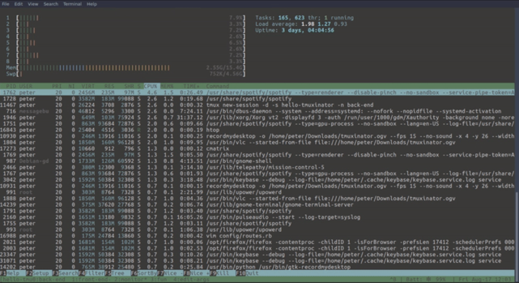

# Things that really make a difference

Ordered list of "basic" skills that need to be aquired to enjoy the ride 

(Also a cool cheat sheet page maintained here [https://github.com/ruanbekker/cheatsheets#readme](https://github.com/ruanbekker/cheatsheets#readme))

(Also a cool cheat sheet page maintained here [https://github.com/ruanbekker/cheatsheets#readme](https://github.com/ruanbekker/cheatsheets#readme))

## Command line stuff
- bash shell
- ls, cd, mkdir, mv, rm, ln, which,  …
- hostname, whoami, passwd, chmod, chgrp, …
- history 
- alias
- grep
- sudo

## curl

## gpg, sha-256 …
## ssh
- telnet vs. ssh
- ssh automatic login using public key (https://www.ibm.com/support/pages/automatic-logins-ssh-using-public-keys) 

## tmux
- 1/3 tmux for beginners part: https://dev.to/iggredible/tmux-tutorial-for-beginners-5c52 
- 2/3 tmux for beginners part: https://dev.to/iggredible/useful-tmux-configuration-examples-k3g
- 3/3 muxinator: https://github.com/tmuxinator/tmuxinator/blob/master/README.md
## Tor
- .onion 
- tor hidden services
- Tor browsers (https://www.torproject.org/download/)
- torify / torsocks
## processes
- systemd
- top
- journalctl
- systemctrl

## certificate 
- authority
- expiration
- update
## http vs. https
## OS-layer firewall
## partitions filesystem (/, /mnt, /var, /etc, /tmp)

## UEFI vs. Legacy Boot

## Other tools
- [websocketd](https://github.com/joewalnes/websocketd): Small command-line tool that will wrap an existing command-line interface program, and allow it to be accessed via a WebSocket. WebSocket-capable applications can now be built very easily. As long as you can write an executable program that reads STDIN and writes to STDOUT, you can build a WebSocket server. No networking libraries necessary.
- [tmuxinator](https://github.com/tmuxinator/tmuxinator): Tool that allows you to easily manage tmux sessions by using yaml files to describe the layout of a tmux session, and open up that session with a single command.

## Books
- [Introduction to the Mac command line](https://github.com/ChristopherA/intro-mac-command-line) (on GitHub)
- [Learn Bitcoin from the command line](https://github.com/BlockchainCommons/Learning-Bitcoin-from-the-Command-Line#readme) (on GitHub)
- [Mastering the Lightning Network](https://github.com/lnbook/lnbook#readme) (on GitHub)
## 
- **John Perry Barlow: The Declaration of Independence of Cyberspace**
  - Document: [https://cryptoanarchy.wiki/people/john-perry-barlow](https://cryptoanarchy.wiki/people/john-perry-barlow)
  - Audio, red by the author: [https://www.youtube.com/watch?v=3WS9DhSIWR0](https://www.youtube.com/watch?v=3WS9DhSIWR0)
- **Michael W. Dean: Users Manual for The Human Experience** 
  - pdf book: [https://michaelwdean.com/UMFTHE/Users_Manual_for_The_Human_Experience-eBook.pdf](https://michaelwdean.com/UMFTHE/Users_Manual_for_The_Human_Experience-eBook.pdf)
  - audiobook on YouTube: https://www.youtube.com/watch?v=xpJMFBpGR2s
  - 
