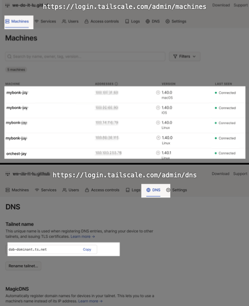
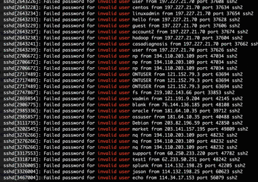
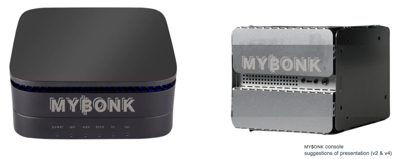
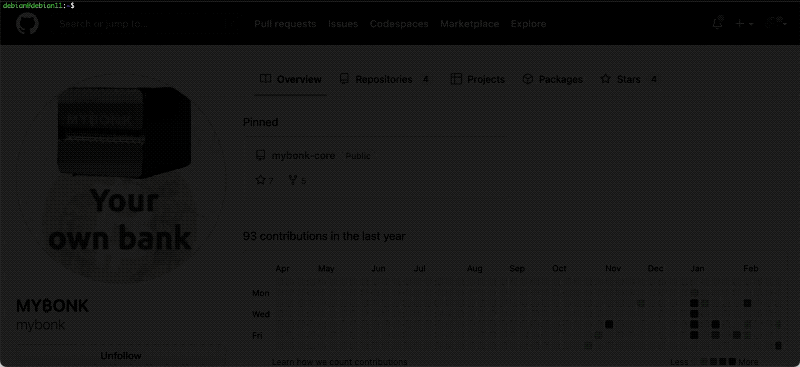

<p align="center">

</p>
<br/>
<p align="center">
👉 Here is maintained the MY₿ONK Wiki, the detailed *manual* installation instructions ✍️. 
</p>
<p align="center">
Anyone can take part on <a href="https://github.com/mybonk" target="_blank">MY₿ONK's GitHub</a>.
<br/>
Join the conversation on the <a href="https://t.me/mybonk_build" target="_blank">Telegram group</a>!
</p>


---
# Table of Contents 
Tip: Click the 'TOC' button () in the
top right corner to display the table of content in a separate pane.
- [0. Before you start](#before-you-start)
  - [Overview](#overview)
  - [Terminology](#terminology)
  - [Advice](#advice)
  - [ssh, auto login and tmux](#ssh-auto-login-and-tmux)
- [1. Build your MYBONK bitcoin full node](#1-build-your-mybonk-bitcoin-full-node)
    - [1.1 The hardware](#11-the-hardware)
    - [1.2 Download and install NixOS](#12-download-and-install-nixos)
    - [1.3 ssh and auto login](#13-ssh-and-auto-login)
    - [1.4 Download and install MYBONK stack](#13-download-and-install-mybonk-stack)
      - [**Option 1.** The "automated" way using MYBONK orchestrator](#13-option-1)
      - [**Option 2.** The "manually" way](#13-option-2)

- [2. Build your MYBONK orchestrator](#2-build-your-mybonk-orchestrator-machine)
    - [2.1. Download and install VirtualBox](#21-download-and-install-virtualbox)
    - [2.2. Build the OS in VirtualBox](#22-build-the-os)
      - [**Option 1.** Using the installation image from Debian](#option-1-using-the-installation-image-from-debian)
      - [**Option 2.** Using a ready-made Virtual Box VDI (Virtual Disk Image)](#option-2-using-a-ready-made-virtual-box-vdi-virtual-disk-image)
    - [2.3. ssh and auto login](#23-ssh-and-auto-login)
    - [2.4. Install Nix](#24-install-nix)
      - [**Option 1.** Using the ready-made binary distribution from nix cache](#option-1-using-the-ready-made-binary-distribution-from-nix-cache)
      - [**Option 2.** Building Nix from the source](#option-2-building-nix-from-the-source)
    - [2.4. Build MYBONK stack](#24-build-mybonk-stack)
    - [2.5. Deploy MYBONK stack to MYBONK consoles](#25-deploy-mybonk-stack-to-mybonk-consoles)
- [3. Operations](#3-operations)
    - [3.1. Baby steps](#31-baby-steps)
    - [3.2. Copy the complete blockchain from another MY₿ONK console](#32-copy-the-complete-blockchain-from-another-my₿onk-console)
    - [3.3. Backup and restore](#33-backup-and-restore)
    - [3.4. Join a Federation](#32-join-a-federation)


# Before you start


Read this document from the beginning to the end before getting your hands on the keyboard. Also watch this presentation by Valentin Gagarin about [Flattening the Learning Curve for Nix/NixOS](https://www.youtube.com/watch?v=WFRQvkfPoDI&list=WL&index=87) as Nix/NixOS is the cornerstone of MY₿ONK.

You might have a feeling of "déjà vu" as it is essentially a scrambled from various sources including [nixOS](https://nixos.org) and [nixOS manual](https://nixos.org/manual/nixos/stable/index.html), [nixOS Wiki](https://nixos.wiki/wiki/Main_Page), [nix-bitcoin](https://nixbitcoin.org/), [Virtual Box](https://www.virtualbox.org/), [Raspibolt](https://raspibolt.org/) and [Raspiblitz](https://github.com/rootzoll/raspiblitz#readme) (although the approach of MY₿ONK is radically different). 

If you have any experience with the command line or already run any other full node you have a significant advantage, you could complete this setup in 2 hours maybe, otherwise allocate 1 day.
  
We [collaboratively] take great pride and care maintaining this document so it remains up to date and concise, often it refers to external links. Explore these external links when instructed to, this will make the journey smoother.
  
It is assumed that you know a little bit of everything but not enough so we show you the way step by step based on the typical MY₿ONK setup.

You too can contribute to improving this document on GitHub.
  
Enjoy the ride, no stress, check out our  [baby rabbit holes](/docs/baby-rabbit-holes.md)  :hole: :rabbit2: and the [FAQ](/docs/faq.md) 👷 


### Overview
This example small ecosystem consists of only two elements that we are going to build together:

 
- **One MY₿ONK orchestrator:**
  This machine is used to orchestrate your fleet of MY₿ONK consoles, it is essentially a Linux with a few additional software installed including the Nix package manager.
- **One MY₿ONK console:**
  This machine runs the [MY₿ONK core](https://github.com/mybonk/mybonk-core) stack on NixOS. It is setup once and its configuration can be updated remotely using MY₿ONK orchestrator.
  
### Terminology
- '``#``' stands for '````$ sudo````'
- **MY₿ONK core**: Or simply 'MY₿ONK' is a tailor-made full-node [software stack](https://github.com/mybonk/mybonk-core) for MY₿ONK console (although it can run on pretty much any hardware if you are ready to tune and hack a little bit). MY₿ONK core is based on nix-bitcoin itself based on nixOS.
- **MY₿ONK console**: A full-node bitcoin-only hardware platform designed with anonymity, security, low price, performance, durability, low-energy, supply chain resilience and generic parts in mind.
- **MY₿ONK orchestrator**:
  Used to orchestrate your [fleet of] MY₿ONK console[s], it is currently a separate Linux machine with a few additional software installed on including the Nix package manager. The MY₿ONK orchestrator will soon be integrated within the MY₿ONK console but for now it is a separate machine ([ref #30](https://github.com/mybonk/mybonk-core/issues/30#issue-1609334323)).
- **MY₿ONK user**: The end user, you, the family man, the boucher, the baker, the hair dresser, the mechanics... Just want the thing to work, "plug and forget". Uses very simple user interface and never uses the command line. On MAINNET.
- **MY₿ONK operator**: A "MY₿ONK user" that got really serious about it and decided to learn more, move to the next level. Has some "skin in the game" on MAINNET and is happy to experiment on SIGNET. Many operators take part in nodes Federations or create their own Federation.
- **MY₿ONK hacker**: A "MY₿ONK operator" so deep in the rabbit hole, bitcoin, privacy and sovereignty that he became a MY₿ONK hacker. That's an advanced user, student, Maker, researcher, security expert .etc... Just want to tear things apart. Love to use command line. On SIGNET.

### Advice

- **Nix vs. NixOS**: It is *very* important to understand the concept that nix and nixOS are different things: 
  - [Nix](https://nixos.org/manual/nix/stable/) is a purely functional package management and build system. Nix is also the expression language designed specifically for the Nix, it is a pure, lazy, functional language. 
    - Purity means that operations in the language don't have side-effects (for instance, there is no variable assignment).
    - Laziness means that arguments to functions are evaluated only when they are needed.
    - Functional means that functions are “normal” values that can be passed around and manipulated in interesting ways. The language is *not* a full-featured, general purpose language. Its main job is to describe packages, compositions of packages, and the variability within packages.

  - NixOS is a Linux distribution based on Nix. In NixOS, the entire operating system — the kernel, applications, system packages, configuration files, and so on — is all built by the Nix package manager. [Here is an overview of the NixOS Linux distribution on NixOS Wiki](https://nixos.wiki/wiki/Overview_of_the_NixOS_Linux_distribution). Furthermore:

    - See how Nix and NixOS work and relate: [https://nixos.org/guides/how-nix-works.html](https://nixos.org/guides/how-nix-works.html)
    - A general introduction to the Nix and NixOS ecosystem: [https://nix.dev](https://nix.dev/)
    - Search functions within the nix ecosystem based on type, name, description, example, category .etc..: [https://noogle.dev](https://noogle.dev/)

- **Read and explore**: The pros write and read documentation, they are not so much on YouTube. For 1 hour of reading you should spend about 4 hours experimenting with what you learned and so on.

- **Be patient**: Learning takes time, getting a node up and running "by hand" takes time (system build, blocks download, various indexing). Also bear in mind that some services on the stack depend on others and won't operate properly before the service(s) they depend on are fully synchronized (e.g. Lightning Network vs. Bitcoin, Sparrow wallet vs Fulcrum).

- **Don't trust, verify**: Anything you download on the internet is at risk of being malicious software. Know your sources. Always run the GPG (signature) or SHA-256 (hash) verification (typically next to the download link of an image or package there is a string of hexadecimal characters).

### ssh auto login and tmux

This is so important that we felt it deserved its own section.

ssh is a pre-requisite for the deployment of MY₿ONK, have a look at the section dedicated to ssh in the [baby rabbit holes section](/docs/baby-rabbit-holes.md#ssh) 🕳 🐇

Spare yourself the pain, learn good habits, save tones time and avoid getting locked out of your system by really understanding how ssh works, particularly ssh auto login (auto login *using public and private keys pair* to be specific), as it is also significantly more secure than simple password-based login.

IP addresses (e.x. ```192.168.0.155```) are not "human friendly" (e.x. ```console_jay```). You can associate an IP address to an arbitrary name, easier to remember. You can configure this in your ssh configuration file ```~/.ssh/config```. Here is an example in its simplest form:

````
Host console_jay
  HostName 192.168.0.155
  User root
````

Whereas you had to connect using the following syntax: 
````bash
$ssh root@192.168.0.155
````

You can now use the following syntax instead:
````bash
$ssh console_jay
````

This is all very nice until you change environment or move your hardware to another network: A new IP address will most likely be assigned to the machine and the shorthand ```console_jay``` will no longer work (IP address 192.168.0.155 unknown); You have to figure out what the new IP address of your machine is. It is *possible* (scan the network or physically connect to serial) but it is always a time consuming pain.

A more effective way to deal with remote access is to use WireGuard/[Tailscale](https://github.com/tailscale). Tailscale basically hides all the nitty gritty of ssh by handling a VPN for you in the background. You need to: 
- Create credentials on [https://login.tailscale.com](https://login.tailscale.com).
- Install Tailscale on all the machines you want to have remote access to.
- You are good to go! 
Your machine is now always available on whatever network, from anywhere in the world using Tailscale's "Magic DNS" and ssh commands are transparently wrapped through the Tailscale VPN. 

  

With tailscale on you can now refer to your remote machine anytime anywhere  through its Tailscale "Magic DNS" name. For instance:

````bash
$ssh console_jay@dab-dominant.ts.net
````

Have a look at this [Tailscale Quick tutorial](https://www.infoworld.com/article/3690616/tailscale-fast-and-easy-vpns-for-developers.html).


Make sure you use ssh auto login (auto login *using public and private keys pair* to be specific) instead of password authentication: Bellow is a real time illustration of ssh failed login attempts (bots, hackers, you name it) on a machine that leaves password authentication enabled on the Internet.




---


# 1. Build your MYBONK bitcoin full node
  
  There are many ways to do this, the one detailed here focuses on people with little (but still *some*) technical knowledge.
  
  These steps can and will be automated but for now the goal is for you to *understand* how it works and the mechanics behind it.
  
### 1.1 The hardware

  There are many many platforms, physical (HW) or virtual (Virtual Machines, Cloud) to choose from, which is what NixOS was made for in the first place and this is great. A collection of hardware specific platform profiles to optimize settings for different hardware is even being maintained at [NixOS Hardware repository](https://github.com/NixOS/nixos-hardware/blob/master/README.md).

  The following steps focus on MY₿ONK console hardware platform only because it would be impossible to maintain and support all the possible combinations for a specific application domain: Each hardware has its own specs, some have additional features (BIOS capabilities, onboard encryption, various kinds of storages and partition systems .etc...) or limitations (too little RAM or unreliable parts, weak power source, "moving parts", cooling issues, higher power consumption .etc...) making it unadvisable to install onto, or too difficult for an average user to setup and maintain; Even little things like bootable or not from USB stick can turn what should be a beautiful journey into hours of frustration trying to just make the thing boot until the next pitfall.

  MY₿ONK console is a full-node bitcoin-only hardware platform designed with anonymity, security, low price, performance, durability, low-energy, supply chain resilience and generic parts in mind. You too can get a MY₿ONK console, just join our [Telegram group](https://t.me/mybonk_build).

  


  MY₿ONK console can also be used to run Raspiblitz similarly to Raspberry pi or other distributions.

### 1.2 Download and install NixOS

  The idea is to kick-start a bare bone NixOS on your MY₿ONK console, from that point we'll able to easily and remotely "flash" MY₿ONK stack on it using the MY₿ONK orchestrator. 

  You can install NixOS on physical hardware by copying it onto a USB stick and booting from it.

  We maintain the detailed manual installation instructions of MY₿ONK console specifically [HERE](./docs/Procedure_NixOS.md). You can also checkout [NixOS' official installation documentation](https://nixos.org/manual/nixos/stable/index.html#ch-installation).

  The complete system behavior is defined in ```/etc/nixos```

  ````bash
  # ls /etc/nixos
  configuration.nix  hardware-configuration.nix
  ````

  - ```configuration.nix```: Through this file all the features and services of the system are configured in this simple, human-readable file (and other ```.nix``` files it might refer to). This file has initially been generated during system setup and contains a few settings by default.

  - ````hardware-configuration.nix````: As the name implies. Auto-generated by the system during setup. You wouldn't normally edit it as it can be re-generated which would overwrite your changes. make changes to ```configuration.nix``` instead.

  Take some time to have a look at "[Nix - A One Pager](https://github.com/tazjin/nix-1p)" for a first brief introduction to Nix, the language used in these '```.nix```' files. 
  

### 1.3 ssh and auto login
  
  
  
  All the MY₿ONK console 'low-level' configuration is done via MY₿ONK orchestrator over ssh. 
  
  As addressed in section "[ssh, auto login and tmux](#ssh-auto-login-and-tmux)" in "0. Before you start" you need to understand the concepts of ssh and public-private key pair.

  Let's enable sshd on this new console, this is also nicely demonstrating how similarly straightforward it would be to precisely configure other services, even a complete system, editing the Nix expression in ```configuration.nix```. 

  We need 2 things: 
  - The IP address of the console you want to connect to.
  - The service ```sshd``` running on it (it is not running nor installed by default).

  The IP address has most likely been assigned by your internet router built-in DHCP server. 

  On the console you can use the command ```ip``` to figure it out:

  ````
  $ ip a

  1: lo: <LOOPBACK,UP,LOWER_UP> mtu 65536 qdisc noqueue state UNKNOWN group default qlen 1000
    link/loopback 00:00:00:00:00:00 brd 00:00:00:00:00:00
    inet 127.0.0.1/8 scope host lo
       valid_lft forever preferred_lft forever
    inet6 ::1/128 scope host 
       valid_lft forever preferred_lft forever
  2: enp2s0: <BROADCAST,MULTICAST,UP,LOWER_UP> mtu 1500 qdisc fq_codel state UP group default qlen 1000
    link/ether 68:1d:ef:2e:0c:b3 brd ff:ff:ff:ff:ff:ff
    inet 192.168.0.64/24 brd 192.168.0.255 scope global dynamic noprefixroute enp2s0
       valid_lft 84565sec preferred_lft 84565sec
    inet6 2a02:2788:a4:285:a1fd:5396:bef5:b7c4/64 scope global temporary dynamic 
       valid_lft 301sec preferred_lft 301sec

  ````
  
  Here you can see the wired network interface ```enp2s0``` has the IP address ```192.168.0.64```. 


  The service ```sshd``` is installed and configured simply by adding a few lines in ```configuration.nix``` which *by default* is under ```/etc/nixos/```:

  ````bash
  # nano /etc/nixos/configuration.nix
  ````
  Add the following lines:

  ````bash
  # Enable the OpenSSH daemon.
  services.openssh = {
    enable = true;
    permitRootLogin = "yes";
  };
  ````

  Save the file and exit. 
  
  [```nixos-rebuild```](https://nixos.wiki/wiki/Nixos-rebuild) is the NixOS command used to apply changes made to the system configuration as well as various other tasks related to managing the state of a NixOS system. For a full list of nixos-rebuild sub-commands and options have a look at it man page (````$ man nixos-rebuild````). 

  Now build the configuration and activate it, but don't add it (just yet) to the bootloader menu. This is done using the ```test``` subcommand:
  ````bash
  # sudo nixos-rebuild test
  building Nix...
  building the system configuration...
  activating the configuration...
  setting up /etc...
  reloading user units for root...
  reloading user units for mybonk...
  setting up tmpfiles
  ````
  Check the system logs as the system is reconfiguring:
  ````bash
  # sudo journalctl -f -n 60
  ````
  Entries referring to the system changes and sshd being enabled are being displayed.

  Check sshd status:
  ````bash
  # systemctl status sshd.service 
● sshd.service - SSH Daemon
     Loaded: loaded (/etc/systemd/system/sshd.service; enabled; preset: enabled)
     Active: active (running) since Mon 2023-01-16 16:46:09 CST; 1h 42min ago
   Main PID: 850 (sshd)
         IP: 326.9K in, 379.5K out
         IO: 3.3M read, 0B written
      Tasks: 1 (limit: 9326)
     Memory: 5.9M
        CPU: 336ms
     CGroup: /system.slice/sshd.service
             └─850 "sshd: /nix/store/qy9jighrfllrfy8shipl3j41m9k336vv-openssh-9.1p1/bin/sshd -D -f /etc/ssh/sshd_config [listener] 0 of 10-100 startup>
  ````

Now that we know the IP address and that sshd is listening let's connect from another machine:

````bash
$ ssh root@192.168.0.64

(root@mybonk_console) Password: 
Last login: Mon Jan 16 06:03:35 2023
#
````

It works, this is great. 

Now we want to configure ssh key-pair, this is typically done using ```ssh-keygen``` to generate the keys and ```ssh-copy-id``` to copy the public key onto the remote machine.

Instead of having to copy the public key onto the remote machine "manually" you can set it in the ```configuration.nix``` file: Let's disable password-based login and use key-pair only instead, in a couple of lines, just make sure you don't "lock yourself out" by disallowing password authentication and forgetting to copy your public key for instance.


  ````bash
  # nano /etc/nixos/configuration.nix
  ````
  
Add the following lines making sure you replace the parameter ```openssh.authorizedKeys.keys``` with your own public key):

  ````bash
  services.openssh = {
    enable = true;
    #permitRootLogin = "yes";
  };

  users.users.root = {
    openssh.authorizedKeys.keys = [
        "ecdsa-sha2-nistp521 AAAAE2VjZHNhLXNoYTItbmlzdHA1MjEAAAAIbmlzdHA1MjEAAACFBABTjXzlHGw941UGukM3HVUTpvsXCLgx7EZRJ83YE32qEe8HtXmGHo41YftauWwnTN5rQvMWTd0puFzXz4vKu7YC1gATUUtYNa6mzgtt+dNvTvLNcQ1vSQ5s19yKKgJjZV1MZBlcf/HklfNdS0Owja1aIrp0jKlJEaTWPXKtN6vkfLSF5r== Jay"
    ]
  ;
  };
  ````
You can get your own public key using the ```cat```command in another terminal (ssh-copy-id will add user@clientmachine after the public key but the "@clientmachine" part can be removed).
````bash
cat ~/.ssh/id_ecdsa.pub

ecdsa-sha2-nistp521 AAAAE2VjZHNhLXNoYTItbmlzdHA1MjEAAAAIbmlzdHA1MjEAAACFBABTjXzlHGw941UGukM3HVUTpvsXCLgx7EZRJ83YE32qEe8HtXmGHo41YftauWwnTN5rQvMWTd0puFzXz4vKu7YC1gATUUtYNa6mzgtt+dNvTvLNcQ1vSQ5s19yKKgJjZV1MZBlcf/HklfNdS0Owja1aIrp0jKlJEaTWPXKtN6vkfLSF5r== Jay@orchestrator
````

More details regarding sshd configuration can be found on the dedicated [nixOS Wiki page](https://nixos.wiki/wiki/SSH_public_key_authentication).

Play around with the settings and ```nixos-rebuild test``` like earlier. When ready you make your changes persistent as new default option in the bootloader by running the ```switch``` subcommand:
  ````bash
  # sudo nixos-rebuild switch
  [sudo] password for mybonk: 
  building Nix...
  building the system configuration...
  updating GRUB 2 menu...
  Warning: os-prober will be executed to detect other bootable partitions.
  Its output will be used to detect bootable binaries on them and create new boot entries.
  lsblk: /dev/mapper/no*[0-9]: not a block device
  lsblk: /dev/mapper/raid*[0-9]: not a block device
  lsblk: /dev/mapper/disks*[0-9]: not a block device
  activating the configuration...
  setting up /etc...
  reloading user units for mybonk...
  setting up tmpfiles
  $ 
  ````

At a later point you'd want to insert a name alias in your ```~/.ssh/config``` file or use Tailscale to not having to remember IP addresses.

This is it, your MY₿ONK console is now ready to be operated through MY₿ONK orchestrator.

### 1.4 Download and install MYBONK stack

  <a name="13-option-1"></a>
  #### **Option 1.** The "automated" way using a MYBONK orchestrator
  - This consists is using MY₿ONK orchestrator to streamline the configuration and provisioning of your MY₿ONK console. 
  - Ref. section [Build your MY₿ONK orchestrator](#build-orchestrator).

  <a name="13-option-2"></a>
  #### **Option 2.** The "manual" way
  - The "manual" way consisting in editing MY₿ONK configuration file ```/etc/nixos/configuration.nix``` locally directly.
  - Use "Option 1."

---

# 2. Build your MYBONK orchestrator

Note: [Ref #30](https://github.com/mybonk/mybonk-core/issues/30#issue-1609334323) - MY₿ONK orchestrator is planned to be integrated within the MY₿ONK console.

This machine is used to orchestrate your [fleet of] MY₿ONK console[s] (services, parameters, secrets). It is used to build MY₿ONK stack configuration and deploy it remotely in a secure and streamlined manner. 

For this reason it is important that this machine remains clean and protected, isolated from threats and vulnerabilities.

The following sections describe the installation of MY₿ONK orchestrator on a VirtualBox virtual machine:
- Download and install VirtualBox
- Build the OS in VirtualBox
- ssh and auto-login
- Install Nix
- Build MYBONK stack

### 2.1. Download and install VirtualBox
  Follow the instructions on their website https://www.virtualbox.org

### 2.2. Build the OS in VirtualBox
  Now that VirtualBox is installed you need to run an OS on it (Linux Debian in our case, or any systemd-based Linux system).
  
  Choose one of the following 2 options:

#### **Option 1.** Using the installation image from Debian
  - From https://www.debian.org/distrib/  
  - With this method you go through the standard steps of installing the Debian OS just as if you were installing it on a new desktop but doing it in a VirtualBox 
  - Don't forget to take note of the the machine's IP address and login details you choose during the installation!
  - Detailed instructions: https://techcolleague.com/how-to-install-debian-on-virtualbox/


#### **Option 2.** Using a ready-made Virtual Box VDI (Virtual Disk Image)
  - From https://www.linuxvmimages.com/images/debian-11/ (this is not a recommendation, this is an example).
  - More convenient and quicker than Option 1, ideal in workshops/demos as it is a pre-installed Debian System.
  - Make sure the network setting of the machine is set to "*bridge adapter*" in VirtualBox. If unsure have a look at [ssh into a VirtualBox](https://www.golinuxcloud.com/ssh-into-virtualbox-vm/#Method-1_SSH_into_VirtualBox_using_Bridged_Network_Adapter).
  - Make sure you generate a new MAC address as shown in the screenshot below before you start the image otherwise if anyone else uses the same image on the network you will get network issues (several machines with same MAC address results in IP addresses conflicts).

    

  - The login details are typically on the download page (in our case ``debian``/```debian``` and can become ```root``` by using ```$ sudo su -``` ). 
  - What we call hostname is the machine name you can see displayed on on the shell prompt. Because this is a pre-built image make sure you set a hostname different from the default, e.x 'orchestartor_ben', it will avoid confusion when connecting remotely. Changing the hostname is done by running the following command:
    ```bash
    # hostnamectl set-hostname orchestartor_ben
    ```
    Check the hostname has been updated:
    ```bash
    $ hostnamectl
    ```
    The shell prompt will reflect the new hostname next time you open a terminal session.

  - Do not use such images in a production environment. 
  - It is common to have issues with keyboard layout when accessing a machine that has been configured in a different language (e.x. the first few letters of the keyboard write ```qwerty``` instead of ```azerty``` and other keys don't behave normally). There are various ways to adjust this in the configuration but it's out of the scope of this document. The simplest and most effective is to find a way to login using the erroneous keyboard layout anyhow figuring out which key is which then once in the Desktop Environment adjust the settings in "Region & Language" > "Input Source".


  - Now you need to install some additional pretty common software packages that will be needed to continue. Debian's package manager is [apt](https://www.cyberciti.biz/tips/linux-debian-package-management-cheat-sheet.html?utm_source=Linux_Unix_Command&utm_medium=faq&utm_campaign=nixcmd). Root privileges are required to modify packages installed on the system which is why we prepend the following commands with [sudo](https://www.cyberciti.biz/tips/linux-debian-package-management-cheat-sheet.html?utm_source=Linux_Unix_Command&utm_medium=faq&utm_campaign=nixcmd).

  - Update the packages index so we are up to date with the latest available ones:

    ```bash
    $ sudo apt update
    ```

  - Install the additional packages (Debian 11 Bullseye) [curl](https://manpages.org/curl), [git](https://manpages.org/git):

    ```bash
    $ sudo apt -y install curl git
    ```

### 2.3. ssh and auto login

You'd want to access your MY₿ONK orchestrator using ssh. 

For more security some Linux distributions restrict ssh usage, for instance such restrictions may apply to ```root``` user.

Check this by opening the sshd configuration ```/etc/ssh/sshd_config``` on the target machine using ```# nano /etc/ssh/sshd_config``` and see the setting ```PermitRootLogin```, its value can be ```yes```, ```prohibit-password```, ```without-password```. The later two ban all interactive authentication methods, allowing only public-key, hostbased and GSSAPI authentication.

It is generally advised to avoid using user ```root``` especially to remote-access. You can use ```sudo -i``` from another user instead when needed so just leave the setting ```PermitRootLogin``` as ```prohibit-password```.


### 2.4. Install Nix
  
  Choose one of the following 2 options.

  #### **Option 1.** Using the ready-made binary distribution from nix cache
  - Quicker and more convenient than Option 2 as it has been pre-built for you.
  - ssh into MY₿ONK orchestrator and run:
    ```bash
    $ sh <(curl -L https://nixos.org/nix/install)   
    ```
  - You can see outputs related to Nix binary being downloaded and installed. 
  - As instructed ensure that the necessary environment variables are set by running the following command:
    ```bash
    $ . ~/.nix-profile/etc/profile.d/nix.sh
    ```
  - Check the installation went OK:
    ```
    $ nix --version
    nix (Nix) 2.12.0
    ```
  - Finally, optionally have a look at the nix man page to familiarize yourself with it and all its sub-commands:
    ```bash
    $ man nix
    ```

  #### **Option 2.** Building Nix from the source
  - Regarded as the "sovereign" way to do it but takes more time.
  - Follow the instructions on nix page https://nixos.org/nix/manual/#ch-installing-source
  

### 2.4. Build MYBONK stack
Now that your MY₿ONK orchestrator is up and running we can use it to build MY₿ONK stack and deploy it seamlessly to the [fleet of] MY₿ONK console(s) in a secure, controlled and effortless way.

[MY₿ONK](https://github.com/mybonk) is derived from nix-bitcoin. Have a look at the GitHub, especially the [MYBONK-core](https://github.com/mybonk/mybonk-core) directory.

- Login to your MY₿ONK orchestrator (make sure that the virtual machine hosting it as described in section '[2. Build your MYBONK orchestrator](#2-build-your-mybonk-orchestrator-machine)' is actually running):

  ```bash
  ssh debian@mybonk_orchestrator
  $
  ```
- Setup passwordless ssh access for user ```root``` to connect from from your MY₿ONK orchestrator to the MY₿ONK console as described in the section [ssh, auto login and tmux](#ssh-auto-login-and-tmux)
- And add a shortcut ```mybonk-console``` in your ssh config file (```~/.ssh/config```): 
  ```
  Host mybonk-console
    Hostname 192.168.0.64
    User root
    PubkeyAuthentication yes
    IdentityFile ~/.ssh/id_rsa
    AddKeysToAgent yes
  ```
- Check that your ssh passwordless access works:
  ```bash
  $ ssh mybonk-console
  Last login: Fri Mar  3 13:27:34 2023 from 192.168.0.64
  # 
  ```
- All good, now you have a standard NixOS running, it will be running you your MY₿ONK console in an instant once we will have deployed MY₿ONK stack to it from your MY₿ONK orchestrator.

### 2.5. Deploy MYBONK stack to MYBONK consoles
  
The main component of MY₿ONK stack is MY₿ONK-core. It is a fork of [nix-bitcoin](https://github.com/fort-nix/nix-bitcoin), augmented of the MY₿ONK specificities, best practices and community (and hardware may you be running an [authentic MY₿ONK console](https://mybonk.co/)).

There are dozens of options available to deploy a nixOS configuration to a remote machine: NixOps, krops, morph, NixUS, deploy-rs, Bento .etc.. , each with their pros and cons.

[NixOps](https://github.com/NixOS/nixops/blob/master/README.md), the official DevOps tool of NixOS is nice but it has some flaws. 

[krops](https://github.com/krebs/krops/blob/master/README.md) solves some of these flaws with very simple concepts, some of its features are:
- store your secrets in password store
- build your systems remotely
- minimal overhead (it's basically just nixos-rebuild switch!)
- run from custom nixpkgs branch/checkout/fork

We are going to use krops, it is also used by the underlying nix-bitcoin, let's not reinvent the wheel.

First read [this very well written article](https://tech.ingolf-wagner.de/nixos/krops/) to get a high level understanding of how krops works, we are going to perform the steps together in the next few steps.

As you can read krops relies on ssh passwordless login, we have configured this in an earlier section let's move on:


- On your MY₿ONK orchestrator machine clone mybonk-core:
  ```bash
  $ git clone https://github.com/mybonk/mybonk-core.git
  ```
- Navigate to the resulting directory:
  ```bash
  $ cd mybonk-core
  ```
- It contains many files and directories, here is a brief description for now:
  - ```configuration.nix```: This (and other .nix files it may refer to) is the configuration file of your console. All features and services are configured in the form of a Nix expression which is short, simple and human-readable. Go ahead, have a look at it, it is self-explanatory.
  - ```hardware-configuration.nix```: You normally don't edit this file, it is specific to MY₿ONK console hardware, but you can find such files for a variety of other hardware (MY₿ONK supports only MY₿ONK console hardware).
  - ```krops```: Directory used for deployment (described in section [#2.5 Deploy MY₿ONK stack to the MY₿ONK consoles](#25-deploy-mybonk-stack-to-the-mybonk-consoles)).
  - ```shell.nix```: The nix-shell configuration file (sourced automatically if nix-shell is run from this directory).
  - ```nix-bitcoin-release.nix```: Hydra jobset declaration.
  - ```mybonk-console```: Directory that contains the elements required to launch the deployment of MY₿ONK consoles on the network.
- Navigate to the directory ```mybonk-console```:
  ```bash
  $ cd mybonk-console
  ```
- Launch the nix shell ```nix-shell```:

  It is very important you do this as [nix-shell](https://nixos.org/manual/nix/stable/command-ref/nix-shell.html) interprets ```shell.nix```, pulls all the dependencies and gives you access to the exact versions of the specified packages.

  ```bash
  $ nix-shell
  ```
- It will take a few minutes to execute and start showing output on the terminal, be patient.
- Once complete you will be greeted by a splash and the nix-shell prompt:
  ```
                    _                 _
    _ __ ___  _   _| |__   ___  _ __ | | __
   | '_ ` _ \| | | | '_ \ / _ \| '_ \| |/ /
   | | | | | | |_| | |_) | (_) | | | |   <
   |_| |_| |_|\__, |_.__/ \___/|_| |_|_|\_\
              |___/
  Enter "h" or "help" for documentation.


  [nix-shell:~/mybonk-core/mybonk-console]$
  ```

- As instructed enter "h" to see the help page describing the commands made available to facilitate your configuration/build/deploy process.

- As you can see from the previous point the command ```deploy``` is used to deploy to your MY₿ONK console:
  ```bash
  $ deploy
  ```

- The output on the terminal is showing you the progress of the process. In the background krops:
  - Copies ```configuration.nix``` (and additional configuration files that might have been defined) to ```/var/src``` on your MY₿ONK console.
  - Creates a directory named ```secrets``` in which the secrets (passwords, keys) of the services are generated.
  - Copies the directory ```secrets``` in ```/var/src/``` on your MY₿ONK console.
  - Runs ```nixos-rebuild switch -I /var/src``` on your MY₿ONK console.
  - Your MY₿ONK console will reconfigure itself on the fly and run a system as per the provided configuration.

MY₿ONK stack is now running on your MY₿ONK console and you can monitor and control its behavior either locally (not recommended) or remotely from your MY₿ONK orchestrator.

# 3. Operations

Unless otherwise stated all the operations in this sections are executed from MY₿ONK orchestartor.

Learn how to use ```tmux``` and ```tmuxinator``` in the [baby rabbit holes](/docs/baby-rabbit-holes.md), it will take a little effort to get used to it but will save you *hours* every week and streamline your operations. We also made a [tmuxinator template](https://github.com/mybonk/mybonk-core/blob/master/.tmuxinator_console.yml) available for you to reuse.



---
### 3.1. Baby steps

Explore the running services using the following simple commands on your MY₿ONK console:
  - General
    - ```nodeinfo```: Helper script (nix-bitcoin module) that prints info about the node's services.
    
  - Bitcoin
    - ```systemctl status bitcoind```: Standard Linux command, have a look at the section about ```systemctl``` in the [baby rabbit holes section](/docs/baby-rabbit-holes.md#ssh) if needed.
    - ```systemctl stop bitcoind```
    - ```systemctl start bitcoind```

  - C-lightning
    - ```systemctl status clightning```: Standard Linux command, have a look at the section about ```systemctl``` in the [baby rabbit holes section](/docs/baby-rabbit-holes.md#ssh) if needed.
    - ```systemctl stop clightning```
    - ```systemctl start clightning```
    - ```lightning-cli getinfo```: Standard c-lightning CLI tool, use ```$ man lightning-cli``` if you don't know lightning-cli yet.


#### 3.1.1 Start the services progressively

Some services take a **very** long time to start for the first time. 

The most obvious examples are bitcoind and fulcrum, requiring **up to a few days** to synchronize and index until they are ready to operate. Software relying on these services may show warnings, error messages and not work until the services they depend on have fully started (e.g. c-lightning complaining about bitcoind not being ready, mempool complaining about fulcrum itself complaining about bitcoind not being ready).

This is a transitional state until the initial synchronization/indexation of these services is complete.

Keep a look at the system logs, they tell you exactly what the system is busy with.
You also stop a particular service complaining because another one is not yet ready to serve requests using the standard systemd commands e.g. ```# systemctl stop clightning``` then ```# systemctl start clightning``` once the system is ready. 

#### 3.1.2 How the secrets are managed
The deployment mechanism we use to push MYBONK stack from the orchestrator to the console(s) (based on krops) creates a a directory named ```secrets``` in which it generates the random default passwords and keys required for the services that are enabled to operate. 

**Be extremely careful with what you do with the content of this directory as it allows anyone with read access to access the services**.


#### 3.1.3 Rebuild MY₿ONK console configuration directly on the host (instead of pushing a new configuration using krops)
  - Whereas NixOS configuration is by default under ```/etc/nixos``` our deployment mechanism based on krops operates from within ```/var/src``` on the host machine.
  - If for some reason you want to rebuild the system directly instead of using the full blown krops mechanism (```deploy```), you can run the following command on the host:
    ```bash
    # nixos-rebuild switch -I /var/src
    ```
  - This is handy to test something out but goes against the principle of streamlined deployment as the configuration on the host is now out of sync with the one maintained from MY₿ONK orchestrator and it will be overwritten next time we deploy.
#### 3.1.4 REPL
  - REPL, or Read-Eval-Print Loop, is a computer environment where user inputs are read and evaluated, and then the results are returned to the user. There is a REPL in Nix providing an interactive environment to explore tools and expressions. Search ```nix repl``` in the [baby rabbit holes](/docs/baby-rabbit-holes.md) page :hole: :rabbit2:
    
---
### 3.2. Copy the complete blockchain from another MY₿ONK console

  What takes most time during a full node installation is copying the complete blockchain. This is done automatically by bitcoind when the service starts and realizes its data directory (```services.bitcoind.dataDir = "/data/bitcoind"``` by default in a MY₿ONK console) is empty or partial so it starts downloading what it needs from another random bitcoin full node on the Internet. 

  Bitcoind taking care of downloading the complete blockchain (nearly 500GB at the time of writting) from the Internet for you is great but can take days and weeks depending on your and the peer peer Internet connectivity, the maximum ateinable transfer rate being at most the worst of either.

  Copying the bitcoin blockchain from a local machine would take a fraction of this time.
  
  You absolutly don't want to copy the whole content of your ```services.bitcoind.dataDir```, only the files in the ```blocks```, ```chainstate``` and optionaly ```indexes```. These files are cross-platform and can be copied between different installations. 
  
  ```blocks``` and ```chainstate``` are known collectively as a node's "block database", they represent all of the information downloaded by a node during the syncing process. In other words, if you copy installation A's block database into installation B, installation B will then have the same syncing percentage as installation A. This is usually far faster than doing the normal initial sync over again. However, when you copy someone's database in this way, **you are trusting them absolutely**. Bitcoin Core assumes its block database files as 100% accurate and trustworthy, whereas during the normal initial sync it treats each block offered by a peer as invalid until proven otherwise (untill it had time to catch-up and process all the blocks sequencialy). If an attacker is able to modify your block database files, then they can do all sorts of evil things which could cause you to lose bitcoins. Therefore, **you should only copy block databases from Bitcoin installations under your personal control, and only over a secure connection**.

  The files in the ```blocks``` and ```chainstate``` directories work hand in hand so it is important to copy **all of them at once** and both nodes have to be shut down while copying. Only the file with the highest number in the ```blocks``` directory is ever written to (earlier files will never change) and are accessed in a highly sequential manner. 
  
  The files in ```indexes``` can also be copied over but would be regenerated automatically by bitcoind if missing anyways.  

  Here are 2 simple possibilities to copy these files using the common tool ```rsync```:

  ##### **Option 1.** Copy from USB drive

  Transfer speed: About 175 M/s -> Need about 6h to transfer 

  - Plug the external drive on your MY₿ONK console
    - USB 3.0 (blue USB ports) is theoretically 10 times faster than USB 2.0 (black ports):
    - Make sure the external drive is USB 3.0 compatible, its USB port must be blue. 
    - Recioprocally make sure you connect the external USB 3.0 drive any of the blue USB 3.0 ports on your MY₿ONK console.
  - ssh to your MY₿ONK console as ```root```
  - Identify the external USB drive using the command ```lsblk```:
    ```bash
    $ lsblk
    ``` 

    The output from this command looks something like this:

    ```bash
    NAME   MAJ:MIN RM   SIZE RO TYPE MOUNTPOINTS
    sda      8:0    0 119.2G  0 disk
    ├─sda1   8:1    0   512M  0 part /boot/efi
    ├─sda2   8:2    0 109.9G  0 part /nix/store
    │                                /
    └─sda3   8:3    0   8.8G  0 part [SWAP]
    sdb      8:16   0 931.5G  0 disk
    └─sdb1   8:17   0 931.5G  0 part /data
    sdc      8:32   0 931.5G  0 disk
    └─sdc1   8:34   0 931.3G  0 part
    ``` 

    The disks ```sda``` and ```sdb``` are internal to MY₿ONK console. Your external disk is ```sdc``` (depending on which USB port it has been plugged it could also be ```sdd```).

  - Create a temporary directory ```/mnt/unmountme``` and mount the disk ```ssd``` on it (most common filesystem types are automatically detected):

    ````bash
    # mkdir /unmountme
    # mount /dev/sdc1 /unmountme
    ````
  - Now let's see how much data needs to be transfered:
    ````bash
    # du -h -d0 /unmountme/bitcoind/{blocks,chainstate,indexes}
    ````

    The output of this command shows:
    ````
    500G    /unmountme/bitcoind/blocks
    5.1G    /unmountme/bitcoind/chainstate
    40G     /unmountme/bitcoind/indexes
    ````
    
    So we have a total of about 545G of data to transfer...

  - Delete de files that potentially already exist at destination:
    ````bash
    # rm -rf /data/bitcoind/{blocks,chainstate,indexes}
    ````
  - Copy blockchain files from your external disk onto your MY₿ONK console (by default ```services.bitcoind.dataDir = "/data/bitcoind"```):

    ````bash
    # rsync -rhvPog --append-verify /unmountme/bitcoind/{blocks,chainstate,indexes} /data/bitcoind
    ````

    The transfer can be interrupted anytime rsync will automatically resume the files transfer where it left it.

    The following does the same thing but also gives a visual indication of the copy progress as well as completion time estimate ('ETA'):
    ````bash
    # rsync -vrltD --stats --human-readable /unmountme/bitcoind/{blocks,chainstate,indexes} /data/bitcoind | pv -lep -s $(find /unmountme/bitcoind/{chainstate,blocks,indexes} -type f | wc -l)
    ````

  - Once ```rsync``` will have finished copying don't forget to restore the correct ownership of the imported files:
    ````bash
    # chown -R bitcoin:bitcoin /data/bitcoind/bitcoin/
    ````

  - Unmount the external drive and delete the temporary directory you created for it:
    ````bash
    # umount /unmountme
    # rmdir /unmountme
    ````

  - Unplug your external drive.

  - Start ```bitcoind``` keeping an eye on the system logs to monitor how the service is recognizing and operating on the blockchain data freshly imported from your external drive.
    ````bash
    # systemctl start bitcoind & journalctl -f 
    ````


  #### **Option 2.** Copy from another machine on the LAN

  Transfer speed: --to be done--

  This method is essentially the same as *Option 1.*, it uses ```rsync``` too but over the LAN.

  - ssh to your MY₿ONK console as ```root```

  - Copy the blockchain data, by default ```services.bitcoind.dataDir = "/data/bitcoind"``` on MY₿ONK consoles:

    ````bash
    # rsync -vrltD --stats --human-readable root@othermybonk.local:/data/bitcoind/{blocks,chainstate,indexes} /data/bitcoind
    ````

  - You might have heard about people ending up with "corrupted" or "incomplete" data and bitcoind re-downloading or re-indexing things depite of having copied the blockchain as explained here. This is most often then not due to the fact the blockchain data we copy from the remote machine is probably live, possibly leaving out some files at the end of the copy. To avoid this stop ```bitcoind``` on the remote machine and run ```rsync``` one last time to ensure clean data has been copied correctly and entirely:
    ````bash
    # rsync -rhvPog --append-verify /unmountme/bitcoind/{blocks,chainstate,indexes} /data/bitcoind
    ````

  - Restore the correct ownership of the imported files:
    ````bash
    # chown -R bitcoin:bitcoin /data/bitcoind/
    ````
  - Start ```bitcoind``` keeping an eye on the system logs to monitor how the service is recognizing and operating on blockchain data freshly imported from your external drive.
    ````bash
    # systemctl start bitcoind & journalctl -f
    ````

---
### 3.3. Backup and restore
  This section explains further the process of backing-up and restoring services and their data.

### 3.3.1 bitcoin

### 3.3.1 clightning

---
### 3.4. Join a Federation
  **Federation**, *noun*, late Latin *foederatio(n- )*: "*An encompassing entity formed by uniting smaller or more localized entities.*"
  
  Federation is a broad term meaning different thinks in different environments.
  In the scope of MYBONK it my refer to a MYBONK federation, Fedimint federation and a Liquid federation.
  
  


