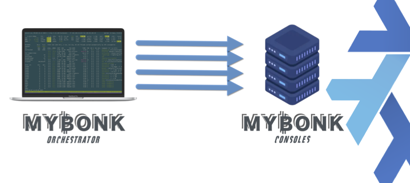

<p align="center">

</p>
<br/>
<p align="center">
👉 Here are maintained MY₿ONK detailed installation instructions ✍️. 
<br/>
It is very much work in progress. 
<br/>
Anyone can clone and contribute on <a href="https://github.com/mybonk" target="_blank">MY₿ONK's GitHub</a>.
<br/>
Join the conversation on the <a href="https://t.me/mybonk_build" target="_blank">Telegram group</a>!
</p>

---
# Table of Contents
- [0. Before you start](#before-you-start)
  - [Overview](#overview)
  - [Terminology](#terminology)
  - [Advice](#advice)
  - [ssh and auto login](#ssh-and-auto-login)
- [1. Build your MYBONK bitcoin full node](#1-build-your-mybonk-bitcoin-full-node)
    - [1.1 The hardware](#11-the-hardware)
    - [1.2 Download and install NixOS](#12-download-and-install-nixos)
    - [1.3 Download and install MYBONK stack](#13-download-and-install-mybonk-stack)
      - [**Option 1.** The "automated" way using MYBONK orchestrator](#13-option-1)
      - [**Option 2.** The "manually" way](#13-option-2)

- [2. Build your MYBONK orchestrator](#2-build-your-mybonk-orchestrator-machine)
    - [2.1. Download and install VirtualBox](#21-download-and-install-virtualbox)
    - [2.2. Build the OS in VirtualBox](#22-build-the-os)
      - [**Option 1.** Using the installation image from Debian](#option-1-using-the-installation-image-from-debian)
      - [**Option 2.** Using a ready-made Virtual Box VDI (Virtual Disk Image)](#option-2-using-a-ready-made-virtual-box-vdi-virtual-disk-image)
    - [2.3. ssh and auto login](#23-ssh-and-auto-login)
    - [2.4. Install Nix](#24-install-nix)
      - [**Option 1.** Using the ready-made binary distribution from nix cache](#option-1-using-the-ready-made-binary-distribution-from-nix-cache)
      - [**Option 2.** Building Nix from the source](#option-2-building-nix-from-the-source)
    - [2.4. Build MYBONK stack](#24-build-mybonk-stack)
    - [2.5. Deploy MYBONK stack to the MYBONK consoles](#25-deploy-mybonk-stack-to-the-mybonk-consoles)
- [3. Basic operations](#3-basic-operations)
    - [3.1. Backup and restore](#31-backup-and-restore)
    - [3.2. Join a Federation](#32-join-a-federation)


# Before you start



Read this document from the beginning to the end before getting your hands on the keyboard. Also watch this presentation by Valentin Gagarin about [Flattening the Learning Curve for Nix/NixOS](https://www.youtube.com/watch?v=WFRQvkfPoDI&list=WL&index=87) as Nix/NixOS is the cornerstone of MY₿ONK.

You might have a feeling of "déjà vu" as it is essentially a scrambled from various sources including [nixOS](https://nixos.org) and [nixOS manual](https://nixos.org/manual/nixos/stable/index.html), [nixOS Wiki](https://nixos.wiki/wiki/Main_Page), [nix-bitcoin](https://nixbitcoin.org/), [Virtual Box](https://www.virtualbox.org/), [Raspibolt](https://raspibolt.org/) and [Raspiblitz](https://github.com/rootzoll/raspiblitz#readme) (although the approach of MY₿ONK is radically different). 

If you have any experience with the command line or already run any other full node you have a significant advantage, you could complete this setup in 2 hours maybe, otherwise allocate 1 day.
  
We [collaboratively] take great pride and care maintaining this document so it remains up to date and concise, often it refers to external links. Explore these external links when instructed to, this will make the journey smoother.
  
It is assumed that you know a little bit of everything but not enough so we show you the way step by step based on the typical MY₿ONK setup.

You too can contribute to improving this document on GitHub.
  
Enjoy the ride, no stress, check out our  [baby rabbit holes](/docs/baby-rabbit-holes.md)  :hole: :rabbit2: and the [FAQ](/docs/faq.md) 👷 


### Overview
This example small ecosystem consists of only two elements that we are going to build together:

 
- **One MY₿ONK orchestrator:**
  This machine is used to orchestrate your fleet of MY₿ONK consoles, it is essentially a Linux with a few additional software installed including the Nix package manager.
- **One MY₿ONK console:**
  This machine runs the [MY₿ONK stack](/docs/MYBONK_stack.md) on NixOS. It is setup once and its configuration can be updated remotely using MY₿ONK orchestrator.
  
### Terminology
- '````#````' stands for '````$ sudo````'
- **MY₿ONK core**: Or simply 'MY₿ONK' is a tailor-made full-node [software stack](/docs/MYBONK_stack.md) for MY₿ONK console (although it can run on pretty much any hardware if you are ready to tune and hack a little bit). MY₿ONK core is based on nix-bitcoin itself based on nixOS.
- **MY₿ONK console**: A full-node bitcoin-only hardware platform designed with anonymity, security, low price, performance, durability, low-energy, supply chain resilience and generic parts in mind.
- **MY₿ONK orchestrator**:
  Used to orchestrate your [fleet of] MY₿ONK console[s], it is currently a separate Linux machine with a few additional software installed on including the Nix package manager. The MY₿ONK orchestrator will soon be integrated within the MY₿ONK console but for now it is a separate machine ([ref #30](https://github.com/mybonk/mybonk-core/issues/30#issue-1609334323)).
- **MY₿ONK user**: The end user, you, the family man, the boucher, the baker, the hair dresser, the mechanics... Just want the thing to work, "plug and forget". Uses very simple user interface and never uses the command line. On MAINNET.
- **MY₿ONK operator**: A "MY₿ONK user" that got really serious about it and decided to learn more, move to the next level. Has some "skin in the game" on MAINNET and is happy to experiment on SIGNET. Many operators take part in nodes Federations or create their own Federation.
- **MY₿ONK hacker**: A "MY₿ONK operator" so deep in the rabbit hole, bitcoin, privacy and sovereignty that he became a MY₿ONK hacker. That's an advanced user, student, Maker, researcher, security expert .etc... Just want to tear things apart. Love to use command line. On SIGNET.

### Advice

- **Nix vs. NixOS**: It is *very* important to understand the concept that nix and nixOS are different things: 
  - [Nix](https://nixos.org/manual/nix/stable/) is a purely functional package management and build system. Nix is also the expression language designed specifically for the Nix, it is a pure, lazy, functional language. 
    - Purity means that operations in the language don't have side-effects (for instance, there is no variable assignment).
    - Laziness means that arguments to functions are evaluated only when they are needed.
    - Functional means that functions are “normal” values that can be passed around and manipulated in interesting ways. The language is *not* a full-featured, general purpose language. Its main job is to describe packages, compositions of packages, and the variability within packages.

  - [NixOS](https://nixos.wiki/wiki/Overview_of_the_NixOS_Linux_distribution) is a linux distribution based on Nix. In NixOS, the entire operating system — the kernel, applications, system packages, configuration files, and so on — is built by the Nix package manager.

  [See how Nix and NixOS work and relate](https://nixos.org/guides/how-nix-works.html). For a general introduction to the Nix and NixOS ecosystem, see [nix.dev](https://nix.dev/).

- **Read and explore**: The pros write and read documentation, they are not so much on YouTube. For 1 hour of reading you should spend about 4 hours experimenting with what you learned and so on.

- **Be patient**: Learning takes time, getting a node up and running "by hand" takes time (system build, blocks download, various indexing). Also bear in mind that some services on the stack depend on others and won't operate properly before the service(s) they depend on are not fully synchronized (e.g. Lightning Network vs. Bitcoin, Sparrow wallet vs Fulcrom).

- **Don't trust, verify**: Anything you download on the internet is at risk of being malicious software. Know your sources. Always run the GPG (signature) or SHA-256 (hash) verification (typically next to the download link of an image or package there is a string of hexadecimal characters).

### ssh and auto login

This is so important that we felt it deserved its own section.

It is pre-requisite for the deployment of MY₿ONK, have a look at the section dedicated to ssh in the [baby rabbit holes section](/docs/baby-rabbit-holes.md#ssh) 🕳 🐇

Spare yourself the pain, learn good habits, save tones time and avoid getting locked out of your system by really understanding how ssh works, particularly ssh auto login (auto login *using public and private keys pair* to be specific, it is also significantly more secure than simple password-based login). 

Bellow is an illustration of ssh failed login attempts by bots, hackers, you name it on your machine if you leave password authentication enabled. 


Also learn how to use ```tmux``` and ```tmuxinator``` (checkout the [baby rabbit holes section](/docs/baby-rabbit-holes.md)), it's a bit steep, but this will save you *hours* every week (the ssh session will always be up and running in their respective window panes even after reboot).


---


# 1. Build your MYBONK bitcoin full node
  
  There are many ways to do this, the one detailed here focuses on people with little (but still *some*) technical knowledge.
  
  These steps can and will be automated but for now the goal is for you to *understand* how it works and the mechanics behind it.
  
### 1.1 The hardware

There are many many platforms, physical (HW) or virtual (Virtual Machines, Cloud) to choose from, which is what NixOS was made for in the first place and this is great. A collection of hardware specific platform profiles to optimize settings for different hardware is even being maintained at [NixOS Hardware repository](https://github.com/NixOS/nixos-hardware/blob/master/README.md).


The following steps focus on MY₿ONK console hardware platform only because it would be impossible to maintain and support all the possible combinations for a specific application domain: Each hardware has its own specs, some have additional features (BIOS capabilities, onboard encryption, various kinds of storages and partition systems .etc...) or limitations (too little RAM or unreliable parts, weak power source, "moving parts", cooling issues, higher power consumption .etc...) making it unadvisable to install onto, or too difficult for an average user to setup and maintain; Even little things like bootable or not from USB stick can turn what should be a beautiful journey into hours of frustration trying to just make the thing boot until the next pitfall.

MY₿ONK console is a full-node bitcoin-only hardware platform designed with anonymity, security, low price, performance, durability, low-energy, supply chain resilience and generic parts in mind. You too can get a MY₿ONK console, just join our [Telegram group](https://t.me/mybonk_build).


MY₿ONK console can also be used to run Raspiblitz similarly to Raspberry pi or other distributions.

### 1.2 Download and install NixOS

Let's now install NixOS on MY₿ONK console. 
The idea is to get NixOS system up and running from there we'll show you how any MY₿ONK console(s) can easily and remotely be fully managed using MY₿ONK orchestrator. 

You can install NixOS on physical hardware by copying it onto a USB stick and booting from it, checkout the [installation procedure](https://nixos.org/manual/nixos/stable/index.html#ch-installation) in their official documentation or the [detailed procedure](./Procedure_NixOS.md) we maintain in this repository.

*******
### 1.3 Download and install MYBONK stack

*******


<a name="13-option-1"></a>
#### **Option 1.** The "automated" way using a MYBONK orchestrator
  Ref. section [Build your MY₿ONK orchestrator](#build-orchestrator).


<a name="13-option-2"></a>
#### **Option 2.** The "manual" way
**The "manual" way consisting in editing MY₿ONK configuration file ```/etc/nixos/configuration.nix``` directly and locally is deprecated, use MY₿ONK orchestrator (based on krops) instead as it provides many other deployment benefits.


---

# 2. Build your MYBONK orchestrator

Note: [Ref #30](https://github.com/mybonk/mybonk-core/issues/30#issue-1609334323) - MY₿ONK orchestrator is planned to be integrated within the MY₿ONK console.

---


This machine is used to orchestrate your [fleet of] MY₿ONK console[s]. MY₿ONK stack is built on it before being pushed to the MY₿ONK console(s). For this reason it is important this machine remains clean and protected to avoid viruses and vulnerabilities. A virtual machine is ideal for this. 

The following sections describe the installation of MY₿ONK orchestrator: 
- Download and install VirtualBox
- Build the OS in VirtualBox
- ssh and auto-login
- Install Nix
- Build MYBONK stack

### 2.1. Download and install VirtualBox
  Follow the instructions on their website https://www.virtualbox.org

### 2.2. Build the OS in VirtualBox
  Now that VirtualBox is installed you need to run an OS on it (Linux Debian in our case, or any systemd-based Linux system).
  
  There are 2 ways to do this:
  #### **Option 1.** Using the installation image from Debian
  - From https://www.debian.org/distrib/  
  - With this method you go through the standard steps of installing the Debian OS just as if you were installing it on a new desktop but doing it in a VirtualBox 
  - Don't forget to take note of the the machine's IP address and login details you choose during the installation!
  - Detailed instructions: https://techcolleague.com/how-to-install-debian-on-virtualbox/
  #### **Option 2.** Using a ready-made Virtual Box VDI (Virtual Disk Image)
  - From https://www.linuxvmimages.com/images/debian-11/ (this is not a recommendation, this is an example).
  - More convenient and quicker than Option 1, ideal in workshops/demos as it is a pre-installed Debian System.
  - Make sure the network setting of the machine is set to "*bridge adapter*" in VirtualBox. If unsure have a look at [ssh into a VirtualBox](https://www.golinuxcloud.com/ssh-into-virtualbox-vm/#Method-1_SSH_into_VirtualBox_using_Bridged_Network_Adapter).
  - Make sure you generate a new MAC address as shown in the screenshot below before you start the image otherwise if anyone else uses the same image on the network you will get network issues (several machines with same MAC address results in IP addresses conflicts).

    

  - The login details are typically on the download page (in our case ``debian``/```debian``` and can become ```root``` by using ```$ sudo su -``` ). 
  - What we call hostname is the machine name you can see displayed on on the shell prompt. Because this is a pre-built image make sure you set a hostname different from the default, e.x 'orchestartor_ben', it will avoid confusion when connecting remotely. Changing the hostname is done by running the following command:
    ```
    # hostnamectl set-hostname orchestartor_ben
    ```
    Check the hostname has been updated:
    ```
    $ hostnamectl
    ```
    The shell prompt will reflect the new hostname next time you open a terminal session.

  - Do not use such images in a production environment. 
  - It is common to have issues with keyboard layout when accessing a machine that has been configured in a different language (e.x. the first few letters of the keyboard write ```qwerty``` instead of ```azerty``` and other keys don't behave normally). There are various ways to adjust this in the configuration but it's out of the scope of this document. The simplest and most effective is to find a way to login using the erroneous keyboard layout anyhow figuring out which key is which then once in the Desktop Environment adjust the settings in "Region & Language" > "Input Source".


  Now you need to install some additional pretty common software packages that will be needed to continue. Debian's package manager is [apt](https://www.cyberciti.biz/tips/linux-debian-package-management-cheat-sheet.html?utm_source=Linux_Unix_Command&utm_medium=faq&utm_campaign=nixcmd). Root privileges are required to modify packages installed on the system which is why we prepend the following commands with [sudo](https://www.cyberciti.biz/tips/linux-debian-package-management-cheat-sheet.html?utm_source=Linux_Unix_Command&utm_medium=faq&utm_campaign=nixcmd).

  Update the packages index so we are up to date with the latest available ones:

  ```
  $ sudo apt update
  ```

  Install the additional packages (Debian 11 Bullseye) [curl](https://manpages.org/curl), [git](https://manpages.org/git), ***[gnupg2](), [dirmngr]()***:

  ```
  $ sudo apt -y install curl git
  ```

### 2.3. ssh and auto login

Note that in Debian ssh restrictions apply to ```root``` user: 

In the ssh server configuration '```/etc/ssh/sshd_config```'

Open the ssh server configuration ```/etc/ssh/sshd_config``` using ```nano /etc/ssh/sshd_config``` and see the setting ```PermitRootLogin```, its value can be ```yes```, ```prohibit-password```, ```without-password```. The later two ban all interactive authentication methods, allowing only public-key, hostbased and GSSAPI authentication.

It is generally advised to avoid using user ```root``` especially to remote-access. You can use ```sudo -i``` from another user instead when needed so just leave the setting ```PermitRootLogin``` as ```prohibit-password```.


### 2.4. Install Nix
  
  
  #### **Option 1.** Using the ready-made binary distribution from nix cache
  - Quicker and more convenient than Option 2 as it has been pre-built for you.

    ssh into the orchestrator and run:
    ``` 
    $ sh <(curl -L https://nixos.org/nix/install)   
    ```

  You can see outputs related to Nix binary being downloaded and installed. 

  
  Installation almost finished: To ensure that the necessary environment variables are set, as instructed, run the following command to 'source' the file:

  ```
  . ~/.nix-profile/etc/profile.d/nix.sh
  ```
      
  Check the installation went OK

  ```
  $ nix --version
  nix (Nix) 2.12.0
  ```

  Have a look at the nix man page to familiarize yourself with it and all its sub-commands.
  ```
  $ man nix
  ```
  

  #### **Option 2.** Building Nix from the source
  - Regarded as the "sovereign" way to do it but takes more time.
  - Follow the instructions on nix page https://nixos.org/nix/manual/#ch-installing-source
  

### 2.4. Build MYBONK stack
Now that your MY₿ONK orchestrator is up and running we can use it to build MY₿ONK stack and deploy it seamlessly to the [fleet of] MY₿ONK console(s) in a secure, controlled and effortless way.

[MY₿ONK stack](/docs/MYBONK_stack.md) is derived from [nix-bitcoin](https://github.com/fort-nix/nix-bitcoin/). Have a look at their GitHub, especially their [examples](https://github.com/fort-nix/nix-bitcoin/blob/master/examples/README.md) section.

Login to your MY₿ONK orchestrator (make sure that the virtual machine hosting it as described in section '[2. Build your MYBONK orchestrator](#2-build-your-mybonk-orchestrator-machine)' is actually running):


```
ssh debian@mybonk_orchestrator
$
```

Setup passwordless ssh access for user ```root``` to connect from from your MY₿ONK orchestrator to the MY₿ONK console (have a look at the section dedicated to ssh in the [baby rabbit holes](/docs/baby-rabbit-holes.md#ssh) if needed).

And add a shortcut for it in your ssh config file (```~/.ssh/config```): 


```
Host mybonk-console-root
    Hostname 192.168.0.64
    User root
    PubkeyAuthentication yes
    IdentityFile ~/.ssh/id_rsa
    AddKeysToAgent yes

```

Now, test that you can ssh without password from your MY₿ONK orchestrator to your MY₿ONK console (using the shortcut ```mybonk-console-root``` we just created:

```
$ ssh mybonk-console-root
Last login: Fri Mar  3 13:27:34 2023 from 192.168.0.64
# 

```

All good, now logout from your MY₿ONK console to get back to your MY₿ONK orchestrator terminal.

MY₿ONK-core is a fork of [nix-bitcoin](https://github.com/fort-nix/nix-bitcoin), augmented of MY₿ONK specificities, best practices and community (and hardware may you decide to run on an [authentic MY₿ONK console](https://mybonk.co/get-involved)).

Start by cloning nix-bitcoin project repository in your MY₿ONK orchestrator home directory:

```
$ git clone https://github.com/mybonk/mybonk-core.git
```

Navigate in the resulting directory:

```
$ cd mybonk-core
```

It contains many files and directories:

- ```configuration.nix```: Explained in a <a href="#configuration.nix">previous session</a>.
- ```krops```: Directory used for deployment (described in section [#2.5 Deploy MY₿ONK stack to the MY₿ONK consoles](#25-deploy-mybonk-stack-to-the-mybonk-consoles))
- ```shell.nix```: The nix-shell file as seen a bit earlier.
- ```nix-bitcoin-release.nix```: Hydra jobset declaration
- ```mybonk-console```: Contains the elements required to launch the deployment of MY₿ONK consoles on the network.


Just navigate in the directory ```mybonk-console```, it contains the elements needed to push your configuration onto your MY₿ONK console:

```
$ cd mybonk-console
```

Run the command ```nix-shell```. It is very important you do this as [nix-shell](https://nixos.org/manual/nix/stable/command-ref/nix-shell.html) (interprets ```shell.nix```) pulls all the dependencies and gives you access to the exact versions of the specified packages.

```
$ nix-shell
```

It will take a few minutes to execute and start showing output on the terminal, be patient.

Once complete you will be greeted by a nix-bitcoin splash and the nix-shell prompt:
```
       _           _     _ _            _       
 _ __ (_)_  __    | |__ (_) |_ ___ ___ (_)_ __  
| '_ \| \ \/ /____| '_ \| | __/ __/ _ \| | '_ \ 
| | | | |>  <_____| |_) | | || (_| (_) | | | | |
|_| |_|_/_/\_\    |_.__/|_|\__\___\___/|_|_| |_|
                                                
Enter "h" or "help" for documentation.

[nix-shell:~/mybonk-core/mybonk-console]$
```

As instructed enter "h" to see the help page describing the commands nix-bitcoin team made available to facilitate the configuration/build/deploy process.


  

### 2.5. Deploy MYBONK stack to the MYBONK consoles
  
There are dozens of options available to deploy a nixOS configuration: NixOps, krops, morph, NixUS, deploy-rs, Bento .etc.. , each with their pros and cons.
[NixOps](https://github.com/NixOS/nixops/blob/master/README.md), the official DevOps tool of NixOS is nice but it has some flaws. [krops](https://github.com/krebs/krops/blob/master/README.md) solves some of these flaws with very simple concepts, some of its features are:
- store your secrets in password store
- build your systems remotely
- minimal overhead (it's basically just nixos-rebuild switch!)
- run from custom nixpkgs branch/checkout/fork

We are going to use krops too as it is already used by nix-bitcoin. 

Read [this very well written article](https://tech.ingolf-wagner.de/nixos/krops/) to get an idea of how krops works before you get started.

First, krops needs to ssh MY₿ONK console using automatic login with keys pair. We have done this earlier let's move on ...

On your orchestrator machine make sure you are in the (```mybonk```) deployment directory, edit ```krops/deploy.nix```` which is the main deployment configuration file:

Locate the FIXME and set the target to the name of the ssh config entry created earlier, i.e. mybonk-node.

```

```


# 3. Basic operations

This is when the tool 'tmuxinator' comes along. 

Have a look at the tmuxinator section in the [baby rabbit holes](/docs/baby-rabbit-holes.md).

For your convenience you can reuse the [tmuxinator template](https://github.com/mybonk/mybonk-core/blob/master/.tmuxinator_console.yml) in the scope of MY₿ONK.


### 3.1. Backup and restore

### 3.2. Join a Federation


