### 1.2 Download and install NixOS

  Now let's install nixOS on MY₿ONK console. 

  A NixOS live CD image can be downloaded from the [NixOS download page](https://nixos.org/download.html#nixos-iso) to install from (make sure you scroll down to the bottom of their home page as the first half of it is about nix *package manager* not nixOS).
  
  Download the "*Graphical* ISO image", it is bigger than the "Minimal ISO image" but it will give you a good first experience using nixOS and will ease some configuration steps like setting up default keyboard layout and disk partitioning which are typical pain points for "not-so-experienced-users". NixOS' new installation wizard in the Graphical ISO image makes it so much more user-friendly.

  Flash the iso image on an USB stick using [balenaEtcher](https://www.balena.io/etcher/).
  
  Plug your MY₿ONK console to the power source and to your network switch using an RJ45 cable.

  Plug-in the screen, the keyboard and the mouse (use a wired mouse to avoid issues, some wireless ones don't work so great and the pointer may jerk around on the screen). These are **used only during this first guided installation procedure**, after this all interactions with the MY₿ONK console will be done "headless" via the MY₿ONK orchestrator as explained in section [Control your MY₿ONK fleet from MY₿ONK orchestrator](#3-basic-operations).

  

  Stick on USB stick in your MY₿ONK console.

  Switch MY₿ONK console on, keep pressing the ``<Delete>`` or ``<ESC>`` key on the keyboard during boot to access the BIOS settings.
  
  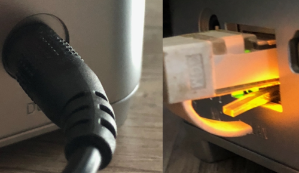


  Make sure the following settings are set in the BIOS:
  
-  ``Boot mode select`` set to ``[Legacy]``
-  ``Boot Option #1`` set to ``USB Device: [USB]``

  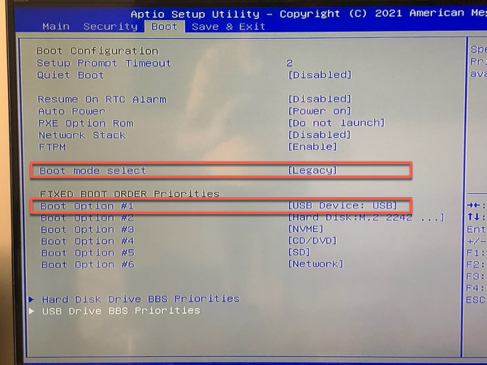

  Let your MY₿ONK console boot from the USB stick.

  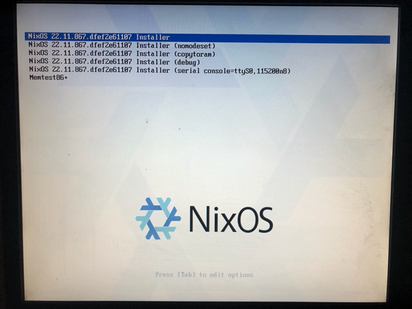

  After the welcome screen the first thing you are asked to configure is your Location, this is used to make sure the system is configured with the correct language and that the corresponding numbers and date formats are used, just choose the right one for you.

  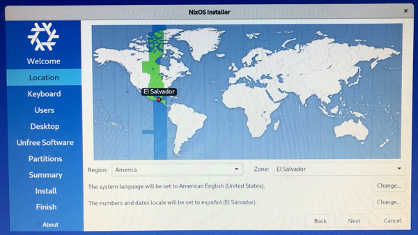

  The next screen is the keyboard layout selection, which is invariably a point people struggle with depending on what country they are from (azerty, querty ...) and also the variants that exist. **Take your time** trying a few (don't forget to try the special characters '@', '*', '_', '-', '/', ';', ':' .etc... ) until you find the best match. In my case it's "French" variant "French (Macintosh)". Not choosing the correct layout will result in keys inversions which will lead to you not being able to log in your system because the password you think you tap in does not actually enter the correct characters.

  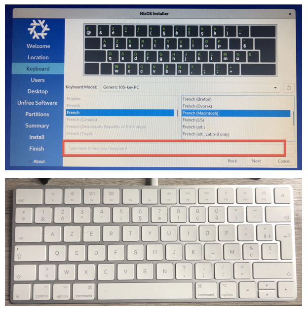
  
  Next you are going to create the users for the system. For now we create a user ```mybonk``` with password ```mybonk``` and we use the same password for the administrator account. 

  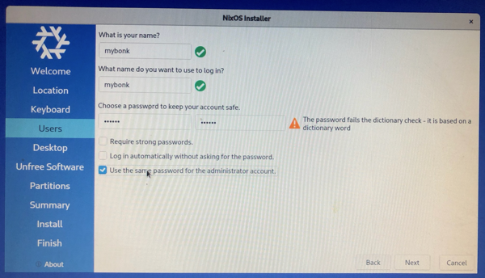

  Next you are going to be asked what Desktop you want to have. We don't want a Desktop, select "No desktop". 

  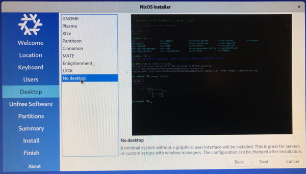

  Confirm "Unfree software" (read the reason behind this mentioned on the screen).
  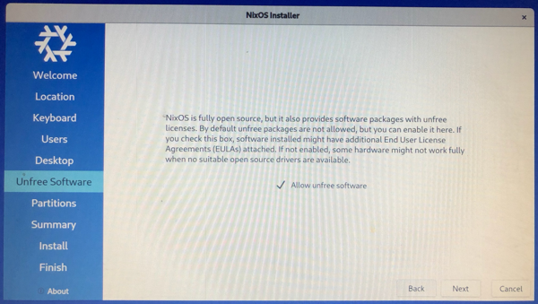


  Now we are going to configure the storage devices and partitions. MY₿ONK console has 2 built-in storage devices:
  - ```/dev/sda``` M1 mSATA 128GB SSD used for *system*: This is where the system boots from, where the operating system (and various caches) lives and where the swap space is allocated. 
  - ```/dev/sdb``` SATA 1TB SSD used for *states*: This is where the system settings, the bitcoin blockchain and installed software settings as well as user data is stored. The data on this drive *persisted*.


  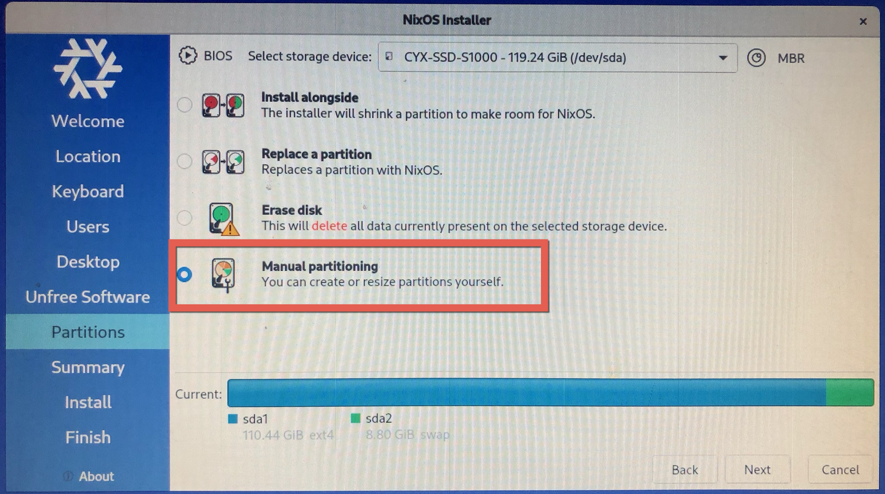

  As this is a fresh new install these drives should not contain any partitions. If there are any on either of the disks delete them by selecting "```New Partition Table```" (creating a new partition table will delete all data on the disk).
  Make sure you select "Master Boot Record (MBR)" instead of GUID Partition Table (GPT) when creating the new partition tables.
  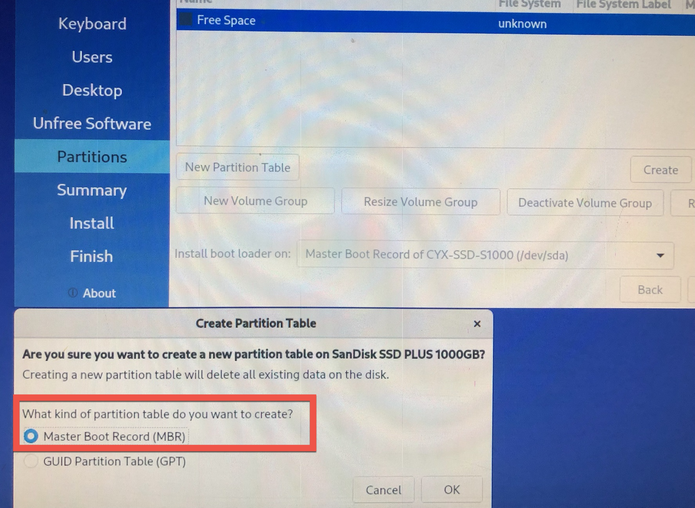


  Let's configure ```/dev/sda```:
  
  
  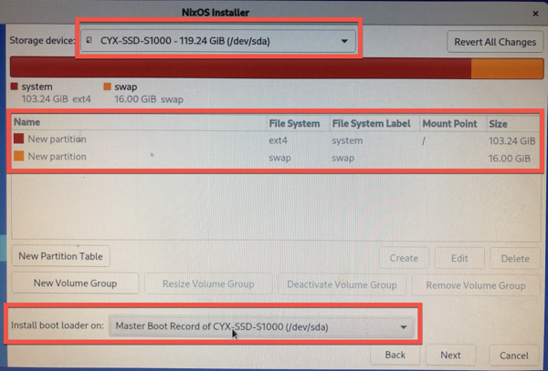

  Let's configure ```/dev/sdb```:
  
  
  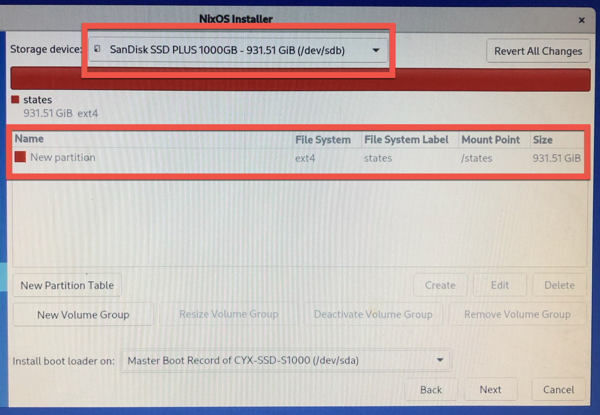


  Now select "Next" to confirm the partitions that are going created (and possibly prior deleted).

  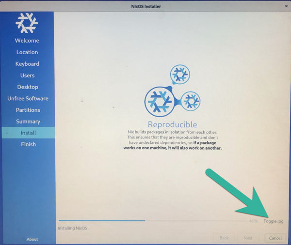


  The installation takes less than one minute click on "Toggle Logs" at the bottom right of the splash screen it to see and understand how the OS is being pulled and installed.

  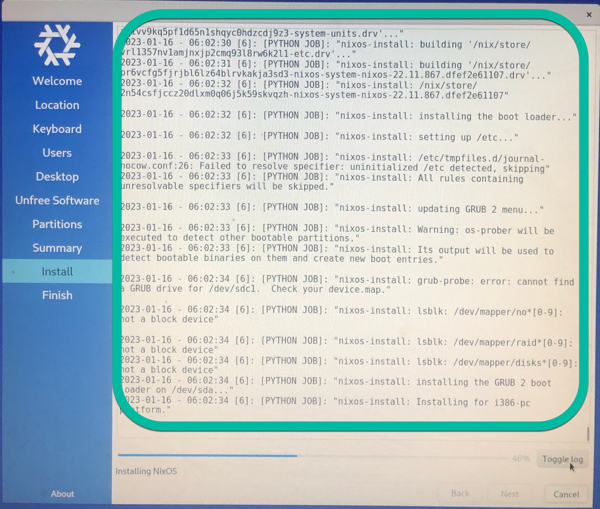

  "All Done". Do **NOT** Unplug the USB stick just yet.

  Select "Restart now" and click on "Done"

  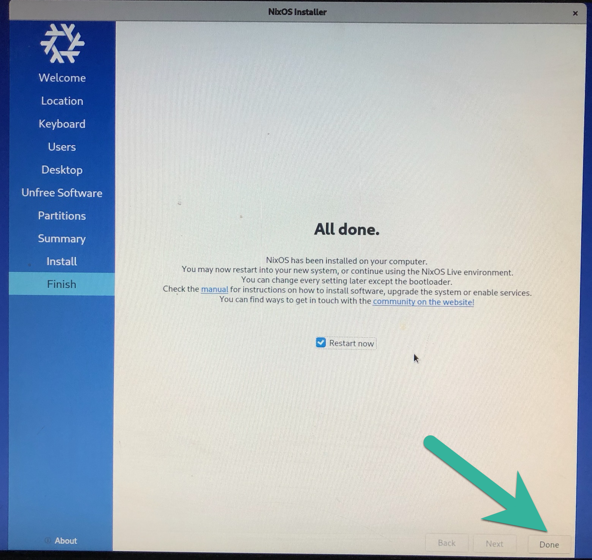

  When MY₿ONK console is rebooting remove the USB stick it will then boot on the MBR of /dev/sda. Your system is now running by itself, let's continue its configuration.

  <div id="configuration.nix" ></div>
  After reboot login to MY₿ONK console as ```root``` password ```mybonk```.
  
  ````
  # ls /etc/nixos
  configuration.nix  hardware-configuration.nix
  ````

  ```configuration.nix``` and ```hardware-configuration.nix``` are the files that have been used to build your NixOS.

  - ```configuration.nix```:
    
    The options you selected in the installation wizard have been translated into entries this file. All features and services of the system are configured in this simple, human-readable file (and other ```.nix``` files it might refer to). 

  - ````hardware-configuration.nix````.
  
    This file was auto-generated by the system during setup, you don't normally edit it, make changes to ```configuration.nix``` instead.

  Take some time to have a look at "[Nix - A One Pager](https://github.com/tazjin/nix-1p)" for a first brief introduction to Nix, the language used in these '```.nix```' files. 
  

  Now you want to remotely connect to your MY₿ONK console using ssh. 
  
  We need 2 things: The IP address of your MY₿ONK console and have it run the service ```sshd``` (not running nor installed by default).
  
  
  The IP address has most likely been assigned by your internet router built-in DHCP server. Look for the IP address of any new device in your internet router panel. 

  Alternatively on the terminal with the command ```ip```:

  ````
  $ ip a

  1: lo: <LOOPBACK,UP,LOWER_UP> mtu 65536 qdisc noqueue state UNKNOWN group default qlen 1000
    link/loopback 00:00:00:00:00:00 brd 00:00:00:00:00:00
    inet 127.0.0.1/8 scope host lo
       valid_lft forever preferred_lft forever
    inet6 ::1/128 scope host 
       valid_lft forever preferred_lft forever
  2: enp2s0: <BROADCAST,MULTICAST,UP,LOWER_UP> mtu 1500 qdisc fq_codel state UP group default qlen 1000
    link/ether 68:1d:ef:2e:0c:b3 brd ff:ff:ff:ff:ff:ff
    inet 192.168.0.64/24 brd 192.168.0.255 scope global dynamic noprefixroute enp2s0
       valid_lft 84565sec preferred_lft 84565sec
    inet6 2a02:2788:a4:285:a1fd:5396:bef5:b7c4/64 scope global temporary dynamic 
       valid_lft 301sec preferred_lft 301sec

  ````
  
  Here you can see the wired network interface ```enp2s0``` has the IP address ```192.168.0.64```.

  To avoid having to remember this IP address we can map it to a hostname in our local ```/etc/hosts``` (this is useful to access systems that do not have a DNS entry or if you want to overwrite them in a test or development environment).

  ````
  $ echo "192.168.0.64 mybonk_console" | sudo tee -a /etc/hosts
  ````
  (or just edit the file manually; we will see later that you can assign names to an IP address in .ssh/config).

  Now let's install, configure and enable ```sshd``` on your MY₿ONK console by tuning the nixOS configuration file:

  ```` 
  # nano /etc/nixos/configuration.nix
  ````
  Add the following lines:

  ````
  # Enable the OpenSSH daemon.
  services.openssh = {
    enable = true;
    permitRootLogin = "yes";
  };
  ````

  Save the file and exit. 
  
  [```nixos-rebuild```](https://nixos.wiki/wiki/Nixos-rebuild) is the NixOS command used to apply changes made to the system configuration as well as various other tasks related to managing the state of a NixOS system. For a full list of nixos-rebuild sub-commands and options have a look at it man page (````$ man nixos-rebuild````). 

  Build the configuration and activate it, but don't add it (just yet) to the bootloader menu. This is done using the ```test``` subcommand:
  ````
  # sudo nixos-rebuild test
  building Nix...
  building the system configuration...
  activating the configuration...
  setting up /etc...
  reloading user units for root...
  reloading user units for mybonk...
  setting up tmpfiles
  ````
  Check the system logs as the system is reconfiguring:
  ````
  # sudo journalctl -f -n 60
  ````
  Entries referring to the system changes and sshd being enabled are being displayed.

  Confirm it is running:
  ````
  # systemctl status sshd.service 
● sshd.service - SSH Daemon
     Loaded: loaded (/etc/systemd/system/sshd.service; enabled; preset: enabled)
     Active: active (running) since Mon 2023-01-16 16:46:09 CST; 1h 42min ago
   Main PID: 850 (sshd)
         IP: 326.9K in, 379.5K out
         IO: 3.3M read, 0B written
      Tasks: 1 (limit: 9326)
     Memory: 5.9M
        CPU: 336ms
     CGroup: /system.slice/sshd.service
             └─850 "sshd: /nix/store/qy9jighrfllrfy8shipl3j41m9k336vv-openssh-9.1p1/bin/sshd -D -f /etc/ssh/sshd_config [listener] 0 of 10-100 startup>
  ````

  
OK now you're ready, ssh into your MY₿ONK console:

````
$ ssh root@mybonk_console

(root@mybonk_console) Password: 
Last login: Mon Jan 16 06:03:35 2023
#
````

Now that we have seen how easy it is to configure a service let's tune the ```sshd``` service further: Let's disable password-based login and use key-pair only instead. Read some about sshd and [how to setup ssh keys](https://goteleport.com/blog/how-to-set-up-ssh-keys/); once you understand the concept go ahead and adjust sshd configuration in the nixOS configuration again accordingly:

  ```` 
  # nano /etc/nixos/configuration.nix
  ````
  So it looks like this (more details regarding sshd configuration on nixOS can be found on the dedicated [nixOS Wiki page](https://nixos.wiki/wiki/SSH_public_key_authentication)):

  ````
  services.openssh = {
    enable = true;
    #permitRootLogin = "yes";
  };

  users.users.root = {
    openssh.authorizedKeys.keys = [
        "ssh-rsa AAAAB3NzaC1yc2EAAAADAQABAAABgQDNI9e9FtUAuBLAs3Xjcgm78yD6psH+iko+DXOqeEO0VQY+faUKJ0KYF8hp2x8WYtlB7BsrYHVfupwk5YwDSvN36d0KgvYj8hqGRbeKAPynmh5NC1IpX3YU911dNOieDAlGaqFnCicl20FER/bXPfOUCHFm0X7YGudqTU5Zm2TkPKvdH7y+a5mYpZbT2cDKEcRcGbWvUcagw0d0e0jLnXwlTO93WVLpyf5hCmbKFGVpIK1ssx1ij0ZB5rmqlVSscbHY5irt8slXoTOW9go/EpkPD5AWb7RhtTbkA4Vrwk0zqbwoRIIjHF75Z0zK/5oTBVVxEtru96nhXzMII/1D2MTqfD43SK34s7RSklTQjMPlewseDAZtL75MRf1t0eurl1jX9c1gKh9FiGqxTxzIGnfCFIhAISOYD+2m0r9xUaBETOUS1JK3pZc0kqrAStBdah5XjqymNGbKFzaotLuLRab/GdEGA4bjBQ8nnh+0m5AZIHxPvqh3EyRd4eoT8IpQPOE= debian@debian11"
    ]
;
  };
  ````

Play around with the settings and ```nixos-rebuild test``` like earlier, just make sure you don't lock yourself out by disallowing password authentication and forgetting to copy your public key on the console for instance.

Once you have tuned and tested your NixOS configuration enough using ```nixos-rebuild test``` it is time to make it the new default option in the bootloader using the ```switch``` subcommand, making these changes persistent after reboot .
  ````
  # sudo nixos-rebuild switch
  [sudo] password for mybonk: 
  building Nix...
  building the system configuration...
  updating GRUB 2 menu...
  Warning: os-prober will be executed to detect other bootable partitions.
  Its output will be used to detect bootable binaries on them and create new boot entries.
  lsblk: /dev/mapper/no*[0-9]: not a block device
  lsblk: /dev/mapper/raid*[0-9]: not a block device
  lsblk: /dev/mapper/disks*[0-9]: not a block device
  activating the configuration...
  setting up /etc...
  reloading user units for mybonk...
  setting up tmpfiles
  $ 
  ````

You have learned how to:
- Enable a service (````sshd````) and tune it by editing its ```.nix``` configuration file.
- Use ssh with and without password (using key pair).
- Test these configuration changes (e.g. ```nixos-rebuild test```, ```systemctl status sshd```, ```journalctl -f -n 30 -u sshd``` ) before making them persistent across reboots (```nixos-rebuild switch```).

The subsequent sections show how your MY₿ONK console(s) can easily and remotely be fully managed using a MY₿ONK orchestrator. 