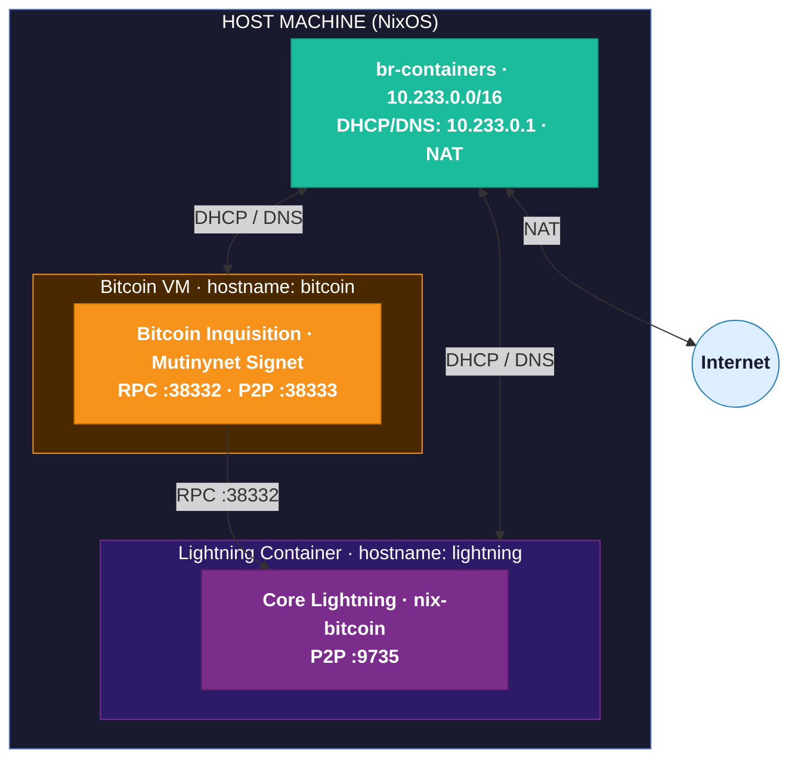
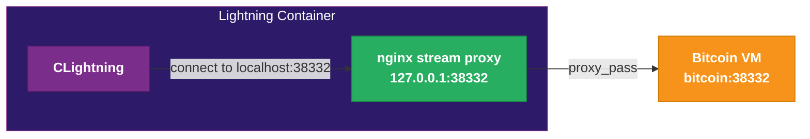
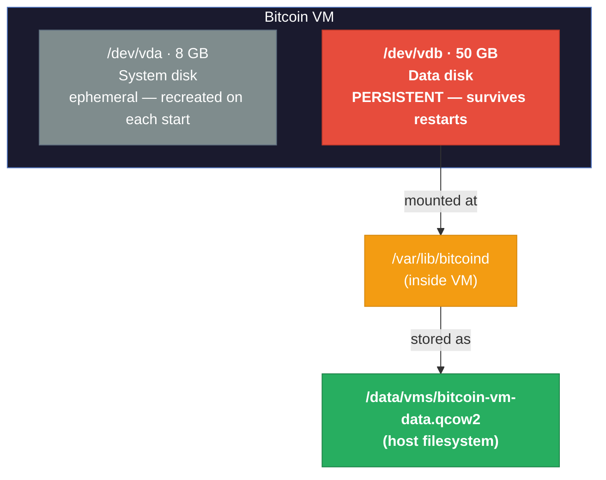

# Workshop 10: Run Mutinynet on a VM and other nix-bitcoin on a Container

## Overview

This workshop demonstrates a **two-tier architecture** for Bitcoin and Lightning infrastructure:
1. **Bitcoin VM** - Runs Bitcoin Inquisition (Mutinynet signet) in a QEMU VM with bridge networking
2. **Lightning Container** - Runs Core Lightning, connects to Bitcoin VM via RPC

**Key Learning Points:**
- Real VM deployment with bridge networking (accessible on host network)
- Automated VM testing with NixOS test framework (isolated testing)
- Container-based Lightning deployment with nix-bitcoin
- VM-to-container RPC communication across bridge network
- Network architecture with DHCP/DNS/NAT
- Two testing modes: test.nix (automated VM tests) vs test-container.sh (container integration tests)

**Prerequisites:**
- [workshop-9](../workshop-9/) - Container networking and testing
- [workshop-3](../workshop-3/) - Package overrides

---

## 🚀 New Features

### ⭐ Daemon Mode (`--daemon` flag)
Run the Bitcoin VM in the background. VM survives terminal disconnect and Ctrl-C.

```bash
# Start in background
sudo ./run-bitcoin-vm.sh --daemon

# Stop cleanly
sudo ./stop-bitcoin-vm.sh
```

**Why use daemon mode?**
- ✅ VM keeps running after closing terminal
- ✅ No accidental shutdowns from Ctrl-C
- ✅ Production-ready deployment
- ✅ Can manage VM remotely

### 💾 Persistent Storage
Blockchain data automatically saved to disk. No need to re-sync after restarts!

**What persists:**
- ✅ Complete blockchain state (`vm-data/bitcoin-vm.qcow2`)
- ✅ Wallet data
- ✅ Mempool
- ✅ All Bitcoin configuration

**Location:** `workshop-10/vm-data/bitcoin-vm.qcow2` (50GB, auto-created)

**Survives:**
- ✅ VM restarts
- ✅ VM stops (`./stop-bitcoin-vm.sh`)
- ✅ System reboots
- ✅ Ctrl-C exits (in foreground mode)

---

## Architecture



**Two operating modes:**

- **Testing** (`test.nix`): Bitcoin VM runs in an isolated NixOS test framework — no network access, automated validation only.
  `nix build .#checks.x86_64-linux.bitcoin-lightning-mutinynet`
- **Deployment** (actual usage): Both VM and container on the bridge, accessible by hostname.
  `sudo ./run-bitcoin-vm.sh` then `sudo ./manage-containers.sh create lightning`

**Data flow (deployment):** Bitcoin VM gets IP via DHCP → Lightning container gets IP via DHCP → Lightning calls bitcoin:38332 via RPC → both reach the internet via NAT through the host bridge.

---

## File Structure

```
workshop-10/
├── flake.nix                 # Defines bitcoin VM and lightning container configs
├── configuration.nix         # Bitcoin VM/container configuration
├── container-lightning.nix   # Core Lightning container configuration
├── run-bitcoin-vm.sh         # Wrapper script to run VM with bridge networking
├── test.nix                  # VM-based automated tests (Bitcoin only)
├── test-container.sh         # Container-based tests (Lightning + Bitcoin integration)
└── README.md                 # This file
```

---

## Transparent Bitcoin RPC Forwarding via nginx

Services like Core Lightning and electrs are designed to talk to a **local** bitcoind on `127.0.0.1:38332`. In our architecture, bitcoind lives on the **bitcoin VM** — a separate machine. Reconfiguring every service individually is fragile; nix-bitcoin's auto-generated config may override those changes anyway.

Instead, `container-lightning.nix` runs an **nginx TCP proxy** that listens on `127.0.0.1:38332` and silently forwards connections to `bitcoin:38332` on the remote VM. Every service in the container connects to localhost as it normally would and never needs to know about the remote VM.



The relevant config in `container-lightning.nix`:

```nix
services.nginx = {
  enable = true;
  streamConfig = ''
    resolver 10.233.0.1 valid=10s;
    server {
      listen 127.0.0.1:38332;
      proxy_pass bitcoin:38332;
      proxy_connect_timeout 5s;
      proxy_timeout 300s;
    }
  '';
};
```

The `resolver` directive tells nginx to re-resolve the `bitcoin` hostname on each new connection using the bridge's dnsmasq. This means the proxy keeps working even if the bitcoin VM gets a new IP — no service restart needed.

---

## Part 1: Bitcoin VM Testing

The Bitcoin VM runs automated tests using NixOS's test framework. This validates the Bitcoin configuration without requiring live network access.

### Running VM Tests

```bash
# Run all tests with output
nix build .#checks.x86_64-linux.bitcoin-lightning-mutinynet -L

# Or just check (silent if passing)
nix flake check
```

### What the Tests Validate

- ✅ Bitcoin Inquisition binary (Mutinynet fork) works
- ✅ Signet mode configuration is correct
- ✅ RPC interface responds
- ✅ Wallet operations function
- ✅ Multi-node P2P connectivity
- ✅ 30-second block time (if connected to Mutinynet)

### Test Output

Note: The test framework uses "node1" and "node2" as VM names for automated testing. This is different from the deployment VM which uses hostname "bitcoin".

```
Test "Bitcoin service is running on node1" passed
Test "Bitcoin RPC responds on node1" passed
Test "Bitcoin wallet operations on node1" passed
Test "Verify Mutinynet Bitcoin fork" passed
...
All tests passed!

Bitcoin VM Configuration validated:
  ✓ Mutinynet Bitcoin Inquisition fork (pre-built binary)
  ✓ Bitcoin Core (Mutinynet signet configuration)
  ✓ Multi-node network connectivity
  ✓ Service startup and RPC functionality
  ✓ Bitcoin peer-to-peer connection
  ✓ 30-second block time verification
```

---

## Part 2: VM and Container Deployment

For actual deployment, Bitcoin runs in a VM (accessible on the network) and Lightning runs in a container.

### Step 1: Build and Start Bitcoin VM

The Bitcoin VM connects to the host's bridge network (br-containers) and gets DHCP from the host.

**Important: The VM now uses PERSISTENT STORAGE for blockchain data!**

```bash
# Build the Bitcoin VM
nix build .#packages.x86_64-linux.bitcoin-vm
```

#### Persistent Storage Architecture

The VM uses a **persistent qcow2 disk image** to store Bitcoin blockchain data:



**Key Benefits:**
- ✅ Blockchain data survives VM restarts
- ✅ No need to re-sync from scratch each time
- ✅ Data persists even if you Ctrl-C the VM
- ✅ Automatic creation on first run (50GB disk)
- ✅ Can backup/restore the disk image

#### Option A: Run in Foreground (Default)

Interactive mode with console access. Good for testing and development.

```bash
# Run the VM with the wrapper script (handles tap device setup)
# Requires sudo for bridge networking
sudo ./run-bitcoin-vm.sh

# First run automatically creates persistent disk:
# Creating persistent data disk: vm-data/bitcoin-vm.qcow2 (50G)
# ✓ Created persistent disk at vm-data/bitcoin-vm.qcow2
#   This disk will store Bitcoin blockchain data
#   Data persists across VM restarts

# VM will start and display console
# Wait for boot to complete (auto-login as root)
# Press Ctrl-A then X to quit QEMU console

# NOTE: Even if you exit with Ctrl-C, blockchain data is preserved!
```

#### Option B: Run in Background (Daemon Mode) ⭐ RECOMMENDED

Best for long-running deployments. VM continues running after terminal disconnect.

```bash
# Start VM in background
sudo ./run-bitcoin-vm.sh --daemon

# First run creates persistent disk automatically:
# Creating persistent data disk: vm-data/bitcoin-vm.qcow2 (50G)
# ✓ Created persistent disk at vm-data/bitcoin-vm.qcow2

# VM starts in background and outputs:
# ✓ Bitcoin VM started in background
#   PID: 12345
#   PID file: /var/run/bitcoin-vm.pid
#   Data disk: /Users/jay/github/mybonk-wiki/workshop-10/vm-data/bitcoin-vm.qcow2

# Check if VM is still running
ps -p $(cat /var/run/bitcoin-vm.pid)

# Stop the VM when done (data is preserved!)
sudo ./stop-bitcoin-vm.sh

# Restart later - data is still there!
sudo ./run-bitcoin-vm.sh --daemon
# Using existing persistent data disk: vm-data/bitcoin-vm.qcow2
```

**Benefits of Daemon Mode + Persistent Storage:**
- ✅ VM survives terminal disconnect and Ctrl-C
- ✅ Blockchain data persists across sessions
- ✅ Can stop/start VM without losing sync progress
- ✅ Production-ready deployment
- ✅ Multiple restarts don't require re-downloading blockchain

### Verify VM is Up and Reachable

After starting the VM (foreground or daemon), verify it's accessible:

```bash
# 1. Test DNS resolution
# The host's DNS server assigns hostname "bitcoin" to the VM
ping -c 3 bitcoin

# Should show:
# PING bitcoin (10.233.0.X) 56(84) bytes of data.
# 64 bytes from bitcoin (10.233.0.X): icmp_seq=1 ttl=64 time=0.123 ms

# 2. Test Bitcoin RPC accessibility
curl -s --user bitcoin:bitcoin \
  --data-binary '{"jsonrpc": "1.0", "id":"test", "method": "getblockchaininfo", "params": [] }' \
  -H 'content-type: text/plain;' \
  http://bitcoin:38332/ | jq .result.chain

# Should output: "signet"

# 3. Check Bitcoin sync status
curl -s --user bitcoin:bitcoin \
  --data-binary '{"jsonrpc": "1.0", "id":"test", "method": "getblockchaininfo", "params": [] }' \
  -H 'content-type: text/plain;' \
  http://bitcoin:38332/ | jq '.result | {chain, blocks, initialblockdownload}'

# Should show:
# {
#   "chain": "signet",
#   "blocks": 2682292,
#   "initialblockdownload": true  # false when fully synced
# }
```

**Get VM IP Address (if needed):**

The VM gets an IP from the host's DHCP server (10.233.0.x range) and is assigned hostname "bitcoin".

```bash
# Usually you can just use the hostname "bitcoin"
ping bitcoin

# To get the actual IP address (from host):
cat /var/lib/dnsmasq/dnsmasq.leases | grep bitcoin
# Shows: 1234567890 52:54:00:12:34:56 10.233.0.2 bitcoin *

# Or from inside the VM console:
ip addr show eth0 | grep "inet "
# Shows: inet 10.233.0.2/16 brd 10.233.255.255 scope global dynamic eth0
```

**Verify Bitcoin (Mutinynet) is running in VM:**

```bash
# Inside the VM (login as root):
# Run the same getblockchaininfo command as earlier with RPC but this time using bitcoin-cli on bitcoin VM
bitcoin-cli -signet -rpcuser=bitcoin -rpcpassword=bitcoin getblockchaininfo

{
  "chain": "signet",
  "blocks": 62408,
  "headers": 2010000,
  "bestblockhash": "000003170c16276d49f6eb48b3fbaeda4038ee16134fc14608462b561a0e1580",
  "bits": "1e0377ae",
  "target": "00000377ae000000000000000000000000000000000000000000000000000000",
  "difficulty": 0.001126515290698186,
  "time": 1683618592,
  "mediantime": 1683618410,
  "verificationprogress": 1,
  "initialblockdownload": true,
  "chainwork": "000000000000000000000000000000000000000000000000000000464e467fb4",
  "size_on_disk": 46711607,
  "pruned": false,
  "signet_challenge": "512102f7561d208dd9ae99bf497273e16f389bdbd6c4742ddb8e6b216e64fa2928ad8f51ae",
  "warnings": [
  ]
}
```

You can see that the Mutinynet fork of bitcoin is running because "chain" is "signet" and there is a "signet_challenge" defined ("512102f7561d208dd9ae99bf497273e16f389bdbd6c4742ddb8e6b216e64fa2928ad8f51ae" which is the [challenge of Mutininet](https://faucet.mutinynet.com/)).

# Check if RPC port is listening:
ss -tlnp | grep 38332

# Verify persistent disk is mounted:
lsblk
# Should show /dev/vdb mounted at /var/lib/bitcoind

df -h /var/lib/bitcoind
# Shows disk usage of persistent storage
```

### Managing Persistent Storage

The VM uses a persistent disk image for blockchain data at `vm-data/bitcoin-vm.qcow2`.

#### Check Disk Status

```bash
# From host, check disk image info (requires qemu-img)
qemu-img info vm-data/bitcoin-vm.qcow2

# Output shows:
# file format: qcow2
# virtual size: 50 GiB (53687091200 bytes)
# disk size: 12.3 GiB  # Actual space used (grows dynamically)

# Inside VM, check disk usage
ssh root@bitcoin df -h /var/lib/bitcoind
# Or from VM console:
df -h /var/lib/bitcoind
```

### Step 1.5: Test Bitcoin VM RPC Connection (IMPORTANT!)

**Before creating the Lightning container**, verify the Bitcoin VM's RPC is accessible. The Lightning container will use these EXACT same connection details.

**RPC Connection Details:**
- **Hostname:** `bitcoin` (resolved via DNS)
- **RPC Port:** `38332`
- **RPC Username:** `bitcoin`
- **RPC Password:** `bitcoin`

**Test from Host Machine:**

```bash
# Test 1: Verify DNS resolves "bitcoin" hostname
ping -c 3 bitcoin
# Expected: replies from 10.233.0.X

# Test 2: Test RPC connection with curl
curl -s --user bitcoin:bitcoin \
  --data-binary '{"jsonrpc": "1.0", "id":"test", "method": "getblockchaininfo", "params": []}' \
  -H 'content-type: text/plain;' \
  http://bitcoin:38332/ | jq .

# Expected output: "signet"
```

**If RPC tests fail:**
- Check Bitcoin VM is running: `ps aux | grep qemu` or `cat /var/run/bitcoin-vm.pid`
- Check DNS resolution: `nslookup bitcoin` should return 10.233.0.X
- Check VM IP: `cat /var/lib/dnsmasq/dnsmasq.leases | grep bitcoin`
- Check Bitcoin RPC is listening inside VM: SSH to VM and run `ss -tlnp | grep 38332`

**Only proceed to Step 2 if RPC tests succeed!**

---

### Step 2: Create Lightning Container

The Lightning container uses the SAME RPC connection details tested above:
- Hostname: `bitcoin`
- Port: `38332`
- Username: `bitcoin`
- Password: `bitcoin`

These are configured in `container-lightning.nix` via:
```nix
services.bitcoind = {
  address = "bitcoin";     # Hostname from DNS
  rpc.port = 38332;       # Mutinynet signet RPC port
}

services.clightning.extraConfig = ''
  bitcoin-rpcconnect=bitcoin
  bitcoin-rpcport=38332
  bitcoin-rpcuser=bitcoin
  bitcoin-rpcpassword=bitcoin
'';
```

```bash
# Create lightning container
sudo nixos-container create lightning --flake .#lightning

# Start lightning container
sudo nixos-container start lightning

# Wait for lightning to start
sleep 10

# Check lightning status
sudo nixos-container run lightning -- lightning-cli --network=signet getinfo
```

#### Container Management Script (Recommended)

The `manage-containers.sh` script provides easier container management with automatic bridge configuration:

```bash
# Create container (auto-configures bridge)
sudo ./manage-containers.sh create lightning

# Update container configuration (preserves all data!)
# This is the RECOMMENDED way to apply config changes
sudo ./manage-containers.sh update lightning

# Other commands
sudo ./manage-containers.sh list              # Show all containers with IPs
sudo ./manage-containers.sh ip lightning      # Get container IP
sudo ./manage-containers.sh shell lightning   # Open shell in container
sudo ./manage-containers.sh stop lightning    # Stop container
sudo ./manage-containers.sh start lightning   # Start container
```

**Why use the update command?**
- ✅ Preserves all container data (blockchain, secrets, etc.)
- ✅ Automatically fixes bridge configuration if needed
- ✅ No need to destroy and recreate container
- ✅ Safe to run multiple times

**When to use update:**
- After editing `container-lightning.nix`
- After enabling/disabling services (electrs, mempool, clightning)
- When container gets wrong IP (10.233.1.x instead of 10.233.0.x)

**Common workflow:**
```bash
# 1. Edit configuration
vim container-lightning.nix

# 2. Update container (preserves data)
sudo ./manage-containers.sh update lightning

# 3. Verify it's working
sudo ./manage-containers.sh ip lightning
sudo nixos-container run lightning -- systemctl status bitcoind
```

### Step 3: Verify VM-to-Container Connectivity

Before running tests, verify that the Lightning container can reach the Bitcoin VM via DNS:

```bash
# Get container IP
LIGHTNING_IP=$(sudo nixos-container show-ip lightning)
echo "Lightning container IP: $LIGHTNING_IP"

# From Lightning container, ping Bitcoin VM using hostname
sudo nixos-container run lightning -- ping -c 3 bitcoin

# Should show:
# PING bitcoin (10.233.0.X) 56(84) bytes of data.
# 64 bytes from bitcoin (10.233.0.X): icmp_seq=1 ttl=64 time=0.456 ms

# Test RPC connection from Lightning to Bitcoin (using hostname)
sudo nixos-container run lightning -- curl -s \
  --user bitcoin:bitcoin \
  --data-binary '{"jsonrpc": "1.0", "id":"test", "method": "getblockchaininfo", "params": [] }' \
  -H 'content-type: text/plain;' \
  http://bitcoin:38332/ | jq .result.chain

# Should output: "signet"

# From Bitcoin VM, ping Lightning container (if running foreground mode)
# Login to VM console, then:
ping -c 3 $LIGHTNING_IP
```

### Step 4: Run Integration Tests

**Note:** The test script creates a temporary container named `tlightning` to avoid conflicts with your deployment `lightning` container.

```bash
# Run comprehensive container tests
# Creates temporary "tlightning" container
sudo ./test-container.sh

# Or keep test container for manual inspection
sudo ./test-container.sh --keep
```

### Test Output

```
========================================
Core Lightning Container Test Suite
Network: Mutinynet Signet
========================================

✅ Test 1: Verify workshop files
✅ Test 2: Check for existing test container
✅ Test 3: Verify bitcoind accessibility
✅ Test 4: Wait for Bitcoin IBD to complete
✅ Test 5: Create Core Lightning container
✅ Test 6: Start container
✅ Test 7: Verify network connectivity
✅ Test 8: Verify clightning service
✅ Test 9: Verify Lightning RPC socket
✅ Test 10: Test Lightning RPC commands
✅ Test 11: Verify Bitcoin backend connection
✅ Test 12: Generate Lightning address
✅ Test 13: List Lightning funds
✅ Test 14: Check service logs

========================================
Test Summary
========================================
Passed: 14
Failed: 0
========================================
✅ All tests passed!

Core Lightning container validated:
  ✓ Container created and started
  ✓ Network connectivity (DHCP from host)
  ✓ clightning service running
  ✓ Connected to external bitcoind (10.233.0.2)
  ✓ Lightning RPC working
  ✓ Synced to blockchain (block 12345)
```

---

## Network Details

### Bitcoin Container

- **RPC Port:** 38332
- **P2P Port:** 38333
- **RPC Credentials:**
  - Username: `bitcoin`
  - Password: `bitcoin`
- **Network:** Mutinynet signet
- **Signet Challenge:** `512102f7561d208dd9ae99bf497273e16f389bdbd6c4742ddb8e6b216e64fa2928ad8f51ae`
- **Mutinynet Node:** `45.79.52.207:38333`

### Lightning Container

- **P2P Port:** 9735
- **Network:** Bridge (10.233.0.0/16)
- **DHCP Server:** 10.233.0.1 (host)
- **DNS:** Host-provided
- **Bitcoind Connection:** Local (127.0.0.1:38332)
- **nix-bitcoin:** Enabled with secret management
- **Secrets Location:** `/etc/nix-bitcoin-secrets/` (inside container)
  - Auto-generated on first boot
  - Persistent across container restarts
  - Deleted if container is destroyed
  - On host: `/var/lib/nixos-containers/lightning/etc/nix-bitcoin-secrets/`

### Host Configuration

The host provides networking infrastructure for containers:
- **Bridge Network:** `br-containers` (10.233.0.0/16)
- **DHCP Range:** 10.233.0.2 - 10.233.255.254
- **DNS Server:** 10.233.0.1
- **NAT:** Enabled for internet access

---

## Manual Testing

### Bitcoin VM Commands

```bash
# Access the Bitcoin VM console (if running in foreground mode)
# Auto-login as root (no password needed)

# Inside the VM, check blockchain status
bitcoin-cli -signet -rpcuser=bitcoin -rpcpassword=bitcoin getblockchaininfo

# Generate address
bitcoin-cli -signet -rpcuser=bitcoin -rpcpassword=bitcoin getnewaddress

# Get balance
bitcoin-cli -signet -rpcuser=bitcoin -rpcpassword=bitcoin getbalance

# From host machine, test RPC access to VM using hostname
curl -s --user bitcoin:bitcoin \
  --data-binary '{"jsonrpc": "1.0", "id":"test", "method": "getblockchaininfo", "params": [] }' \
  -H 'content-type: text/plain;' \
  http://bitcoin:38332/ | jq .result.chain
# Should output: "signet"
```

### Lightning Container Commands

**Inside lightning container:**
```bash
# Login to container
sudo nixos-container root-login lightning

# Check local bitcoind status (uses nix-bitcoin auto-generated credentials)
bitcoin-cli -signet getblockchaininfo

# Get peer info
bitcoin-cli -signet getpeerinfo

# Using curl with nix-bitcoin credentials:
RPC_PASS=$(cat /etc/nix-bitcoin-secrets/bitcoin-rpcpassword-privileged)
curl -u privileged:$RPC_PASS \
  -d '{"jsonrpc":"1.0","id":"curl","method":"getblockchaininfo","params":[]}' \
  -H 'content-type: text/plain;' \
  http://127.0.0.1:38332/ | jq .result

# Check Lightning status (currently disabled)
# lightning-cli --network=signet getinfo

# Generate Lightning address
# lightning-cli --network=signet newaddr

# List funds
# lightning-cli --network=signet listfunds
```

**From host:**
```bash
# Query local bitcoind in container
sudo nixos-container run lightning -- bitcoin-cli -signet getblockchaininfo

# One-liner with jq
sudo nixos-container run lightning -- bitcoin-cli -signet getblockchaininfo | jq
```

**Note:** The Lightning container runs its own local bitcoind with nix-bitcoin. RPC credentials are auto-generated and stored in `/etc/nix-bitcoin-secrets/`.

### Check IPs

```bash
# Bitcoin VM IP (from within VM console or SSH)
ip addr show eth0

# Or from host, check DHCP leases using hostname
cat /var/lib/dnsmasq/dnsmasq.leases | grep bitcoin
# Shows: 1234567890 52:54:00:12:34:56 10.233.0.2 bitcoin *

# Or simply use the hostname from host
ping bitcoin

# Lightning container IP
sudo nixos-container show-ip lightning

# List all containers
sudo nixos-container list
```

---

## Key Differences from Workshop-9

| Aspect | Workshop-9 | Workshop-10 |
|--------|------------|-------------|
| **Bitcoin** | Regtest (private network) | Mutinynet signet (public testnet) |
| **Block Time** | Manual generation (`generatetoaddress`) | Automatic 30-second blocks |
| **Bitcoin Source** | Standard Bitcoin Core | Bitcoin Inquisition (Mutinynet fork) |
| **Lightning** | Integrated in same container | Separate container |
| **Testing** | Single test.sh for everything | test.nix (VM) + test-container.sh (containers) |
| **Network** | Isolated local network | Connected to live Mutinynet |
| **Coins** | Generated locally | From faucet (https://faucet.mutinynet.com/) |

---

## Bitcoin Network Comparison

Comprehensive comparison of Bitcoin networks and their storage requirements:

| Network | Type | Blockchain Size | Block Time | Age/History | Use Case | Storage Needs |
|---------|------|----------------|------------|-------------|----------|---------------|
| **Bitcoin Mainnet** | Production | ~550-600 GB | 10 minutes | 15+ years (since 2009) | Real value, production apps | 1 TB+ recommended |
| **Bitcoin Testnet3** | Public Testnet | ~30-40 GB | 10 minutes | ~10 years (since 2012) | Public testing, no value | 100 GB recommended |
| **Mutinynet Signet** | Custom Signet | ~3-8 GB | 30 seconds | ~1.5 years (since mid-2023) | Fast testing, soft fork features | 50 GB (this workshop) |
| **Default Signet** | Public Signet | ~5-10 GB | 10 minutes | ~3 years (since 2020) | Centrally signed, predictable | 50 GB recommended |
| **Regtest** | Local Private | <100 MB | On-demand | Ephemeral (workshop-9) | Isolated testing, instant blocks | 1-5 GB sufficient |

### Network Details

#### Bitcoin Mainnet
- **Real Bitcoin** with actual monetary value
- Full node requires ~550-600 GB and growing (~50-80 GB/year)
- Recommended: 1 TB disk with pruning disabled
- Use for: Production applications, real transactions
- **Workshop coverage:** Not covered (production use only)

#### Bitcoin Testnet3
- Public testnet with no monetary value
- Free coins from faucets
- Occasionally reset when too large
- Behavior identical to mainnet (10-minute blocks)
- **Workshop coverage:** Not covered

#### Mutinynet Signet (This Workshop)
- **Custom signet** with Bitcoin Inquisition features
- 30-second blocks = 20x faster than mainnet
- Active soft forks: Anyprevout, CTV, OP_CAT, etc.
- Live infrastructure: faucet, explorer, Lightning nodes
- Current size: ~3-8 GB (efficient for testing)
- **Workshop coverage:** ✅ **Workshop-10** (VM + Lightning)

#### Default Signet
- Centrally signed by Bitcoin Core developers
- Predictable block production (10 minutes)
- More stable than testnet3
- Smaller and more manageable than testnet3
- **Workshop coverage:** Could be configured in workshop-10

#### Regtest (Workshop-9)
- Private local network, no external peers
- Blocks generated instantly on-demand with `generatetoaddress`
- Blockchain resets on every restart (ephemeral)
- Perfect for: unit tests, CI/CD, isolated development
- Size: typically <100 MB (only blocks you generate)
- **Workshop coverage:** ✅ **Workshop-9** (containers)

### Storage Recommendations by Use Case

| Use Case | Recommended Network | Storage | Workshop |
|----------|-------------------|---------|----------|
| Learning & Tutorials | Regtest | 1-5 GB | Workshop-9 |
| Fast Testing | Mutinynet Signet | 50 GB | Workshop-10 |
| Realistic Testing | Testnet3 or Signet | 100 GB | - |
| Soft Fork Testing | Mutinynet Signet | 50 GB | Workshop-10 |
| Production | Mainnet | 1 TB+ | - |

### Quick Comparison: Mutinynet vs Regtest

**Use Mutinynet (Workshop-10) when:**
- ✅ You need a live network with other peers
- ✅ Testing Lightning channels with real nodes
- ✅ Trying soft fork features (Anyprevout, CTV, etc.)
- ✅ Want realistic block timing (30 seconds)
- ✅ Need persistent blockchain state

**Use Regtest (Workshop-9) when:**
- ✅ You need isolated testing environment
- ✅ Want instant block generation
- ✅ Testing Bitcoin Core functionality
- ✅ Running automated tests/CI
- ✅ Don't need external connectivity

---

## Troubleshooting

### Bitcoin VM Issues

**VM won't start or network issues:**
```bash
# Check if br-containers bridge exists on host
ip addr show br-containers

# Verify host has DHCP server running
systemctl status dnsmasq

# Run VM with wrapper script
sudo ./run-bitcoin-vm.sh

# Common issues:
# - br-containers bridge not configured on host (run workshop-9 host setup)
# - Permission denied for bridge access (must run with sudo)
# - MAC address conflict (edit flake.nix to change MAC)
```

**bitcoind not starting in VM:**
```bash
# Login to VM console (root/nixos)
# Check logs
journalctl -u bitcoind.service -n 50

# Check if service is running
systemctl status bitcoind.service

# Common issues:
# - Data directory permissions
# - Port conflicts (38332, 38333)
# - Invalid bitcoin.conf syntax
```

**Can't connect to Mutinynet:**
```bash
# Inside VM, check network connectivity
ping -c 3 45.79.52.207

# Check VM has internet access via NAT
ping -c 3 8.8.8.8

# Check peers
bitcoin-cli -signet -rpcuser=bitcoin -rpcpassword=bitcoin getpeerinfo

# Verify signet configuration
bitcoin-cli -signet -rpcuser=bitcoin -rpcpassword=bitcoin getblockchaininfo | grep chain
```

**Container has wrong IP (10.233.1.x instead of 10.233.0.x):**

This happens when the container configuration doesn't include proper bridge settings. The manage-containers.sh update command automatically fixes this:

```bash
# Quick fix - update command auto-fixes bridge configuration
sudo ./manage-containers.sh update lightning

# The update command will:
# 1. Check bridge configuration in /etc/nixos-containers/lightning.conf
# 2. Fix it if needed (sets HOST_BRIDGE=br-containers)
# 3. Update the container from flake
# 4. Restart with correct IP (10.233.0.x)
# 5. Preserve all data (blockchain, secrets, etc.)

# Verify fix worked
sudo ./manage-containers.sh ip lightning
# Should now show 10.233.0.x
```

**Lightning container networking issues:**
```bash
# From Lightning container, ping host gateway
sudo nixos-container run lightning -- ping -c 3 10.233.0.1

# From Lightning container, ping Bitcoin VM (for comparison)
sudo nixos-container run lightning -- ping -c 3 bitcoin

# Check DNS resolution from Lightning container
sudo nixos-container run lightning -- nslookup bitcoin
# Should resolve to 10.233.0.X

# Check if container got IP via DHCP
sudo nixos-container show-ip lightning
# Should show 10.233.0.x (not 10.233.1.x)
# If showing 10.233.1.x, see "Container has wrong IP" above
```

### Lightning Container Issues

**Local bitcoind not responding:**
```bash
# Check if local bitcoind is running inside container
sudo nixos-container run lightning -- systemctl status bitcoind

# Check bitcoind logs
sudo nixos-container run lightning -- journalctl -u bitcoind -n 50

# Test RPC connection to local bitcoind
sudo nixos-container run lightning -- bitcoin-cli -signet getblockchaininfo

# Using curl with nix-bitcoin credentials (inside container):
sudo nixos-container root-login lightning
RPC_PASS=$(cat /etc/nix-bitcoin-secrets/bitcoin-rpcpassword-privileged)
curl -u privileged:$RPC_PASS \
  -d '{"jsonrpc":"1.0","id":"test","method":"getblockchaininfo","params":[]}' \
  -H 'content-type: text/plain;' \
  http://127.0.0.1:38332/ | jq .result

# Check if RPC port is listening
ss -tlnp | grep 38332
# Should show: 127.0.0.1:38332

# Check clightning logs (if enabled)
# sudo nixos-container run lightning -- journalctl -u clightning.service -n 50
```

**Network routing issues:**
```bash
# Check container can reach bitcoin VM using hostname
sudo nixos-container run lightning -- ping -c 3 bitcoin

# Test DNS resolution
sudo nixos-container run lightning -- nslookup bitcoin
# Should resolve to 10.233.0.X

# Check Bitcoin VM firewall (should be disabled)
# From host, using hostname:
ping bitcoin
ssh root@bitcoin  # Then check: systemctl status firewalld
```

---

## Cleanup

### Stop VM (Preserves Blockchain Data)

```bash
# Stop Bitcoin VM (if running in daemon mode)
sudo ./stop-bitcoin-vm.sh

# Or manually:
# sudo kill $(cat /var/run/bitcoin-vm.pid)
# sudo ip link delete vmtap0

# NOTE: Blockchain data is PRESERVED in vm-data/bitcoin-vm.qcow2
# Restarting the VM will resume with existing blockchain state
```

### Destroy Containers

⚠️ **WARNING: Container destruction permanently deletes ALL container data, including blockchain state!**

**Before destroying a container, consider using the update command instead:**

```bash
# RECOMMENDED: Update container to apply config changes (preserves all data)
sudo ./manage-containers.sh update lightning

# This fixes most issues without losing blockchain data:
# - Applies configuration changes
# - Fixes bridge networking issues
# - Updates service configurations
# - Preserves blockchain state and secrets
```

**Only destroy containers when:**
- You genuinely want to delete all data and start fresh
- The container is a test container you no longer need
- You're cleaning up after workshop completion

```bash
# Destroy specific containers (⚠️ DELETES all container data)
sudo nixos-container destroy lightning
sudo nixos-container destroy tlightning  # If kept from test runs

# Or using the management script
sudo ./manage-containers.sh destroy lightning

# List remaining containers
sudo nixos-container list

# Destroy all containers (⚠️ DELETES all container data)
for c in $(sudo nixos-container list); do sudo nixos-container destroy $c; done

# NOTES:
# - Container blockchain data is stored in /var/lib/nixos-containers/<name>/var/lib/bitcoind/
# - Destroying a container PERMANENTLY DELETES this data
# - VM persistent disk (vm-data/) is NOT affected by container operations
# - To preserve container data, stop the container instead: nixos-container stop <name>
# - Or use update command to apply changes: sudo ./manage-containers.sh update <name>
```

### Complete Cleanup (Deletes Everything)

```bash
# Stop VM
sudo ./stop-bitcoin-vm.sh

# Destroy containers
for c in $(sudo nixos-container list); do sudo nixos-container destroy $c; done

# Delete persistent blockchain data (WARNING: Cannot be undone!)
rm -rf vm-data/

# This removes:
# - vm-data/bitcoin-vm.qcow2 (blockchain data)
# - All backups in vm-data/
```

### What Gets Preserved vs Deleted

| Action | VM System | VM Blockchain Data | Container Data |
|--------|-----------|-------------------|----------------|
| `./stop-bitcoin-vm.sh` | ❌ Deleted | ✅ Preserved | ✅ Preserved |
| `nixos-container stop` | N/A | N/A | ✅ Preserved |
| `nixos-container destroy` | N/A | ✅ Preserved (VM) | ❌ **DELETED** |
| `rm -rf vm-data/` | ❌ Deleted | ❌ **DELETED** | ✅ Preserved |
| Restart VM | ✅ Recreated | ✅ Preserved | ✅ Preserved |

**Key Points:**
- **Stopping containers** (`nixos-container stop`) preserves all data
- **Destroying containers** (`nixos-container destroy`) **permanently deletes** container blockchain data
- VM blockchain data (vm-data/) is separate and unaffected by container operations
- Container data location: `/var/lib/nixos-containers/<name>/var/lib/bitcoind/signet/`

---

## Next Steps

1. **Get Mutinynet coins:** Visit https://faucet.mutinynet.com/
2. **Open Lightning channels:** Connect to other Mutinynet Lightning nodes
3. **Test Lightning payments:** Send/receive payments on Mutinynet
4. **Explore nix-bitcoin:** Add more services (LND, electrs, BTCPay Server)
5. **Production deployment:** Adapt configuration for mainnet

---

## References

- [Bitcoin Inquisition](https://github.com/bitcoin-inquisition/bitcoin)
- [Mutinynet](https://blog.mutinywallet.com/mutinynet/)
- [nix-bitcoin Documentation](https://github.com/fort-nix/nix-bitcoin)
- [Core Lightning Documentation](https://docs.corelightning.org/)
- [NixOS Container Documentation](https://nixos.org/manual/nixos/stable/#ch-containers)
- [NixOS Test Framework](https://nixos.org/manual/nixos/stable/#sec-nixos-tests)
