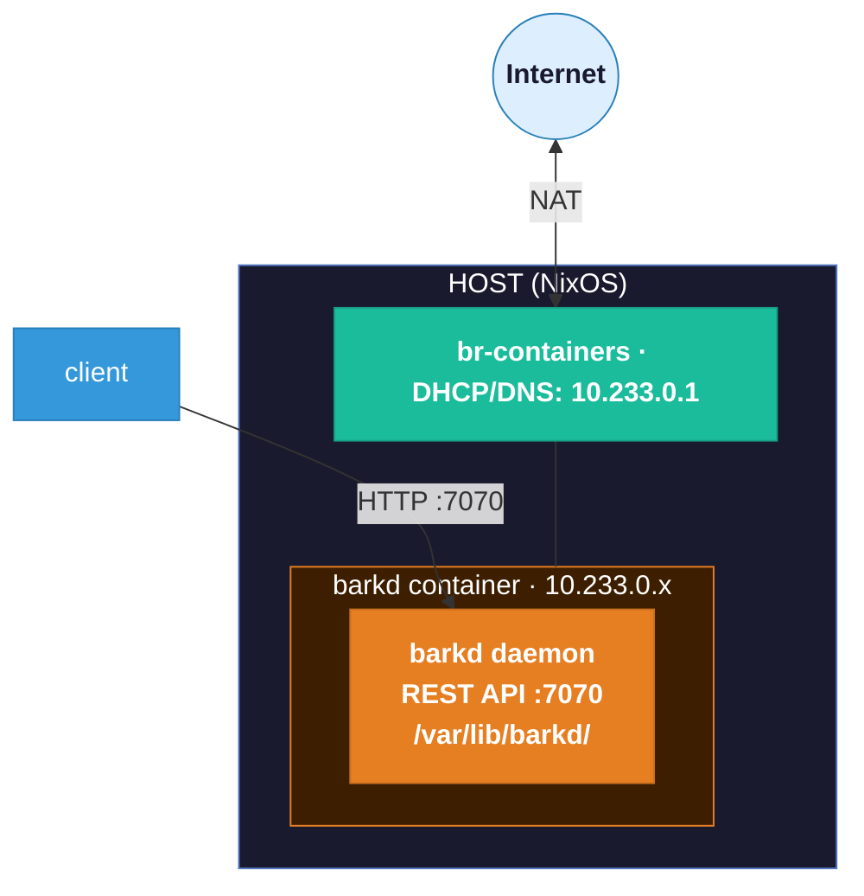

# Workshop 20: Own your Ark wallet: Build and run barkd the Nix way

## Overview

[**Bark**](https://second.tech/docs/barkd/) is Second's reference implementation of the [Ark protocol](https://ark-protocol.org/) — a Bitcoin Layer 2 designed for fast, low-cost, self-custodial payments. **barkd** is the wallet daemon: it runs in the background and exposes a local REST API for sending and receiving payments over Ark, Lightning, and on-chain Bitcoin.

> **Signet only.** The Ark protocol is experimental. Never use barkd with real Bitcoin.

**What you will learn:**
- How to use an upstream project's `flake.nix` to get a reproducible Rust build environment
- How to build a Rust workspace binary as a Nix derivation (`nix build`)
- How to run a third-party daemon as a NixOS container service

**Prerequisites:**
- [Workshop 10](../workshop-10/) — NixOS containers and bridge networking
- Nix with flakes enabled (`nix-command` and `flakes` in `experimental-features`)

---

## Architecture



---

## File Structure

```
workshop-20/
├── flake.nix            # devShells (from bark) + barkd package + container config
├── container-barkd.nix  # NixOS container module for running barkd as a service
└── README.md
```

---

## Part 1: Build from Source with `nix develop`

This is the fastest way to get a working barkd binary for experimentation. Bark's own `flake.nix` provides a dev shell with the correct Rust toolchain (1.90.0 via [fenix](https://github.com/nix-community/fenix)) and all build dependencies pre-configured.

```bash
# Clone the bark monorepo
git clone https://github.com/ark-bitcoin/bark
cd bark

# Enter the build shell from inside the source tree.
# bark's own flake.nix is picked up here — Rust 1.90.0, protobuf, clang, all included.
nix develop .#build

# Build only the barkd binary
cargo build --bin barkd

# Verify
./target/debug/barkd --version
# barkd 0.1.4

# Explore
./target/debug/barkd --help
```

> The key point: `nix develop` must be run from inside the cloned `bark/` directory
> so Nix picks up bark's own `flake.nix`. Running it from `workshop-20/` gives you
> the right shell tools but no `Cargo.toml` to build from.

The `nix develop .#build` shell is minimal (build deps only). Use `nix develop` or `nix develop .#default` for the full environment including test runners and structured logging tools (`slf`, `slinfo`, `slwarn`, etc.).

Alternatively, skip the clone entirely and reference bark's flake directly:

```bash
# Enter bark's build shell without cloning first
nix develop github:ark-bitcoin/bark#build

# Then clone and build inside the shell
git clone https://github.com/ark-bitcoin/bark
cd bark
cargo build --bin barkd
```

---

## Part 2: Build as a Nix Package

`nix build` produces a store path — a reproducible, pinned binary independent of any local clone.

The `flake.nix` uses the `bark` flake input directly as `src` — it is already pinned in `flake.lock`, so no `fetchFromGitHub` hash is needed. Only the Cargo dependency hash (`cargoHash`) needs to be filled in.

### Step 1: Fill in the cargoHash

```bash
# First run — will fail but print the correct cargoHash
nix build .#barkd 2>&1 | grep "got:"
```

Copy the printed hash into `flake.nix` under `cargoHash`. Now:

```bash
# Build succeeds — binary at ./result/bin/barkd
nix build .#barkd
./result/bin/barkd --version
```

### Why one hash?

The `bark` flake input is fetched and pinned by `nix flake update` / `nix flake lock`, so Nix already knows the exact source tree. The only hash you provide manually is:

| Hash | What it covers |
|------|---------------|
| `cargoHash` | The complete Cargo dependency tree (all crates in `Cargo.lock`) |

This is the hash of all crates that `cargo` would download at build time. Nix verifies it so the build is fully reproducible and auditable — the same `cargoHash` guarantees the same set of dependencies on any machine.

### Pinning to a specific release

To build a specific bark release instead of whatever `flake.lock` currently points to, update the input:

```bash
# Update the bark input to a specific tag
nix flake lock --update-input bark --override-input bark github:ark-bitcoin/bark/v0.1.4
```

Or edit `flake.nix` directly:

```nix
bark.url = "github:ark-bitcoin/bark/v0.1.4";
```

Then re-run the `cargoHash` step above (the hash will differ for each release).

---

## Part 3: Run as a NixOS Container

### Step 1: Ensure the host bridge is configured

The container uses `br-containers` — set up in Workshop 10. If it is not running:

```bash
# Verify bridge exists
ip addr show br-containers
systemctl status dnsmasq
```

### Step 2: Create and start the container

```bash
cd workshop-20

# Create the barkd container
sudo nixos-container create barkd --flake .#barkd

# Start it
sudo nixos-container start barkd

# Get its IP
sudo nixos-container show-ip barkd
# e.g. 10.233.0.5
```

### Step 3: Verify barkd is running

```bash
# Check service status
sudo nixos-container run barkd -- systemctl status barkd

# View logs
sudo nixos-container run barkd -- journalctl -u barkd -n 40

# Hit the REST API from the host
BARKD_IP=$(sudo nixos-container show-ip barkd)
curl http://$BARKD_IP:7070/v1/info | jq
```

### Container management

```bash
# Open a shell inside the container
sudo nixos-container root-login barkd

# Inside the container — barkd is in PATH
barkd --help
journalctl -u barkd -f

# Apply config changes (preserves wallet data)
sudo nixos-container update barkd --flake .#barkd

# Stop (preserves data)
sudo nixos-container stop barkd

# Destroy (DELETES wallet data)
sudo nixos-container destroy barkd
```

### Wallet data

barkd stores all state in `/var/lib/barkd/` inside the container. On the host this maps to:

```
/var/lib/nixos-containers/barkd/var/lib/barkd/
```

Stopping the container preserves the wallet. Destroying it deletes everything.

---

## REST API Quick Reference

```bash
BARKD_IP=$(sudo nixos-container show-ip barkd)
BASE="http://$BARKD_IP:7070"

# Node info
curl $BASE/v1/info | jq

# Wallet balance
curl $BASE/v1/balance | jq

# Generate a receive address
curl -X POST $BASE/v1/address | jq
```

> Bearer token authentication may be required depending on your barkd configuration.
> Check `/var/lib/barkd/` for generated credentials after first start.

Full API reference: https://second.tech/docs/barkd/

---

## Troubleshooting

**`nix build` fails with hash mismatch:**
Follow the two-step hash-filling process in Part 2. Replace both placeholder hashes.

**`nix build` fails with Rust version error (`rustc X.Y.Z is not supported`):**
This means the fenix stable toolchain in `flake.lock` has fallen behind bark's current minimum requirement. Run `nix flake update fenix` to pull the latest stable Rust, then retry. Alternatively, use Part 1 (`nix develop .#build`) which always uses bark's exact pinned toolchain.

**Container REST API unreachable from host:**
```bash
# Confirm port is open inside container
sudo nixos-container run barkd -- ss -tlnp | grep 7070

# Confirm barkd is listening on 0.0.0.0, not 127.0.0.1
sudo nixos-container run barkd -- journalctl -u barkd -n 20
```

**barkd crashes on start:**
```bash
sudo nixos-container run barkd -- journalctl -u barkd -n 50
# Adjust ExecStart flags in container-barkd.nix based on barkd --help output
```

---

## References

- [Bark documentation](https://second.tech/docs/barkd/)
- [bark source repository](https://github.com/ark-bitcoin/bark)
- [Ark protocol](https://ark-protocol.org/)
- [fenix — Rust toolchain management for Nix](https://github.com/nix-community/fenix)
- [NixOS containers](https://nixos.org/manual/nixos/stable/#ch-containers)
