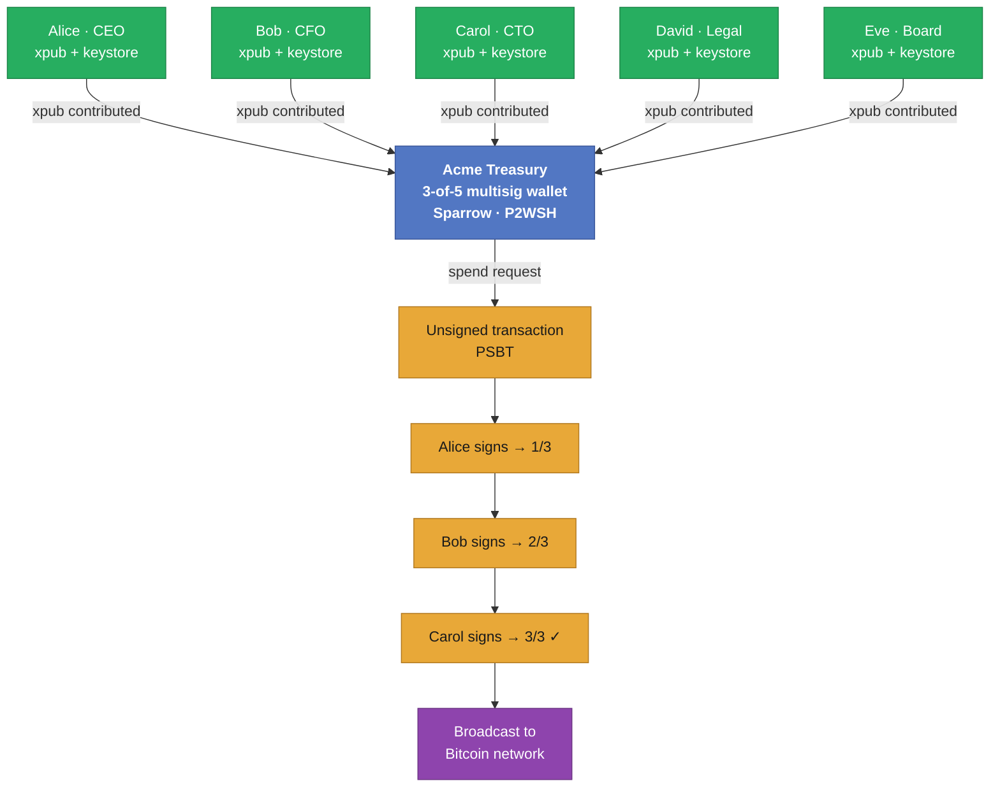
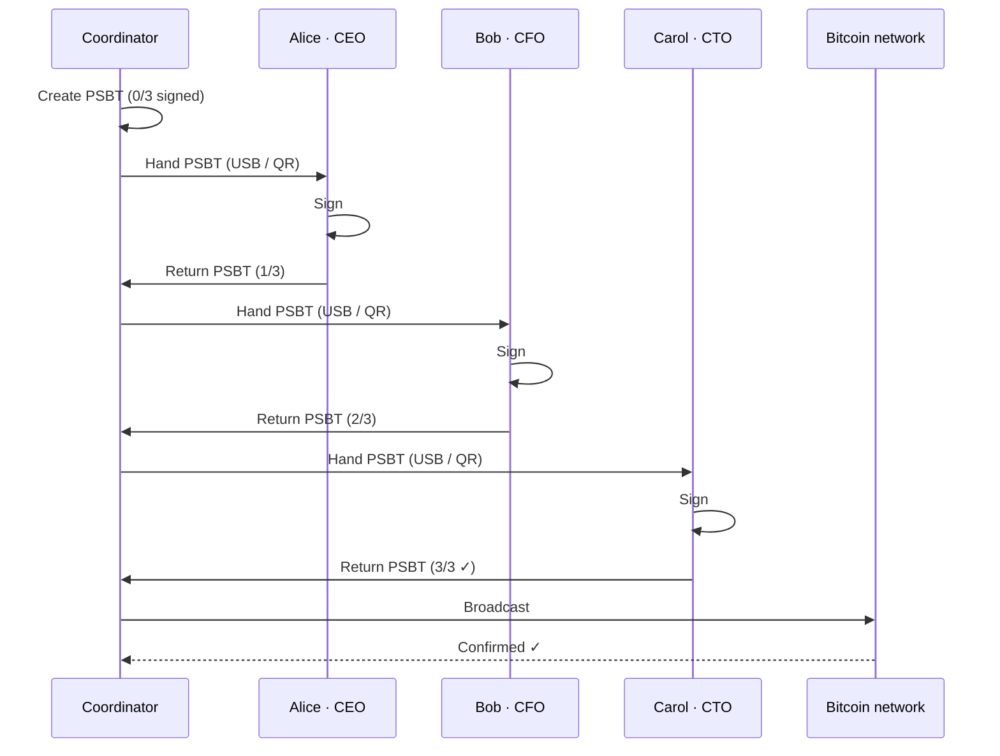
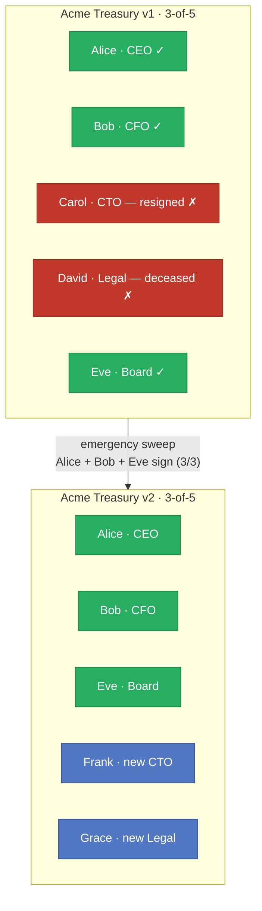

# Workshop 22: Own your multisig treasury: Bitcoin multisig

## Introduction

Multi-signature (multisig) is not a third-party service or an add-on — it is a first-class feature of the Bitcoin protocol itself. **It is the single most important security primitive for any organisation holding Bitcoin.** Every serious Bitcoin treasury, custodian, and exchange that has survived long-term uses it. Those that did not are, in many cases, gone.

In practice, companies that implement multisig do not treat it as a technical task. They treat it as a **ceremony**: a structured, documented, role-assigned process conducted in a physical meeting where each keyholder generates and seals their key material independently, often in the presence of legal witnesses. Getting this ceremony right — and rehearsing the recovery scenario — is as important as the cryptography itself.

> This workshop demonstrates one representative scenario. The full taxonomy of multisig policies (time locks, nested thresholds, social recovery, MPC, Taproot key aggregation) is a subject for a dedicated session.

**Brief technical history**

| Year | Milestone |
|------|-----------|
| 2009 | `OP_CHECKMULTISIG` in Bitcoin's original script engine from day one |
| 2012 | **BIP 16 — P2SH** (Bitcoin Core 0.6): hashed scripts make multisig practical and private on-chain |
| 2017 | **BIP 141 — SegWit / P2WSH**: native SegWit multisig, lower fees, no transaction malleability |
| 2019 | **BIP 174 — PSBT**: standard format for passing a partially-signed transaction between independent signers |
| 2021 | **BIP 340–342 — Taproot**: key aggregation (MuSig2) lets N-of-N multisig look like a single signature on-chain |

This workshop uses **P2WSH** (native SegWit, 3-of-5): well-supported, standard, lower fees than legacy P2SH.

> All hands-on steps run against the test network from [workshop-10](../workshop-10/) — free coins, 30-second blocks, no real funds at risk. The multisig mechanics are identical on mainnet.

---

## Prerequisites

- **[Workshop 10](../workshop-10/)** fully operational: Bitcoin VM running, Lightning container up.
- **Sparrow Wallet** installed on your laptop and already connected to the workshop-10 Bitcoin node (RPC `http://<vm-ip>:38332`, user `bitcoin`, password `bitcoin`, network `signet`).
- Access to the test network faucet (see workshop-10) to get free test coins.

> If Sparrow is not yet connected to workshop-10, open **Preferences → Server → Bitcoin Core**, enter the VM's IP and RPC credentials, and click **Test Connection** until it shows green.

---

## The Scenario

**Acme Treasury Ltd** is a five-partner firm. Their policy: **any 3 of the 5 designated partners must co-sign before any funds leave the company wallet.**

| Keyholder | Role | Sparrow keystore label |
|-----------|------|----------------------|
| Alice | CEO | `alice-ceo` |
| Bob | CFO | `bob-cfo` |
| Carol | CTO | `carol-cto` |
| David | Legal Counsel | `david-legal` |
| Eve | Board Member | `eve-board` |

The wallet policy: **3-of-5 P2WSH multisig.**

---

## Architecture



---

## Part 1: Create the Wallet and Keystores

Both options produce exactly the same `acme-treasury` wallet. Parts 2–4 are identical regardless of which you follow.

---

### Option A — Quick (all in the wizard, ~5 minutes)

Everything happens inside a single Sparrow dialog. All five keystores are generated without leaving the wallet creation wizard.

1. **File → New Wallet** → name: `acme-treasury`
2. Policy Type: **Multi Signature** · Script Type: **Native Segwit (P2WSH)**
3. Set **M = 3**, **N = 5** — Sparrow opens five keystore slots

<!-- SCREENSHOT: ./img/01-multisig-policy-m3-n5.png — Sparrow multisig wizard, M=3 N=5 set -->

4. **Keystore 1 — Alice (CEO)**
   - Click **New or Imported Software Wallet → Mnemonic Words (BIP39) → Generate New**
   - 24 seed words appear — write them on paper, label the envelope `alice-ceo`
   - Click **Import Keystore** → label the slot `alice-ceo`

<!-- SCREENSHOT: ./img/02a-seed-generation-alice.png — 24-word seed screen for alice-ceo -->

5. Repeat for the remaining four slots, using the labels in the scenario table (`bob-cfo`, `carol-cto`, `david-legal`, `eve-board`) — one envelope per person.

<!-- SCREENSHOT: ./img/03-all-five-keystores-wizard.png — all 5 keystores populated in the wizard -->

6. Click **Apply** → the `acme-treasury` wallet is created. Skip to **Part 2**.

---

### Option B — Real-life practice (separate keystores first, ~15 minutes)

This is how it works when each keyholder sits at their own machine. Simulated here on one laptop by creating five separate Sparrow wallets first, then assembling the multisig from their xpubs.

#### Step B-1: Each keyholder generates their key independently

Repeat the following five times (once per person):

1. **File → New Wallet** → name: `alice-ceo`
2. Policy Type: **Single Signature** · Script Type: **Native Segwit (P2WPKH)** *(only the xpub matters — the script type here is irrelevant)*
3. Keystore tab: **New or Imported Software Wallet → Mnemonic Words (BIP39) → Generate New**
4. Write down the 24 seed words — seal in a labelled envelope. In a real ceremony this envelope goes into a physical safe.

<!-- SCREENSHOT: ./img/02b-seed-generation-individual.png — seed generation for an individual keyholder wallet -->

5. **Import Keystore → Apply** — the individual wallet is saved
6. Go to **Settings → Export → Output Descriptor** — copy and save the xpub line; this is the only thing Alice shares with the coordinator

Repeat for `bob-cfo`, `carol-cto`, `david-legal`, `eve-board`.

#### Step B-2: Coordinator assembles the multisig wallet

The coordinator (typically the CFO or a trusted administrator) collects all five xpubs and builds the shared wallet. No private keys are ever shared — only xpubs.

1. **File → New Wallet** → name: `acme-treasury`
2. Policy Type: **Multi Signature** · Script Type: **Native Segwit (P2WSH)**
3. Set **M = 3**, **N = 5**

<!-- SCREENSHOT: ./img/01-multisig-policy-m3-n5.png — same as Option A -->

4. For each keystore slot, click **Add New Keystore → Sparrow Wallet**:
   - Select `alice-ceo` → Sparrow reads her xpub automatically
   - Repeat for the remaining four wallets

<!-- SCREENSHOT: ./img/03-all-five-keystores-assembled-b.png — all 5 xpubs loaded into the coordinator's multisig wallet -->

5. Click **Apply** → `acme-treasury` is created

---

### Backup the wallet descriptor

Regardless of which option you used, do this now:

**Settings → Export → Output Descriptor** — copy the full `wsh(sortedmulti(...))` string and save it somewhere safe.

This descriptor, combined with the five seed phrases, is everything needed to reconstruct the wallet on any machine. Lose it and wallet recovery becomes significantly harder. Store it separately from any individual seed.


---

## Part 2: Fund the Treasury

1. In `acme-treasury`, go to the **Receive** tab
2. Copy the deposit address shown (a `bc1q...` SegWit address on signet)

<!-- SCREENSHOT: ./img/04-receive-address.png — Sparrow Receive tab, multisig deposit address -->

3. Open the test network faucet (see workshop-10) and send test coins to that address
4. Watch the **Transactions** tab — the incoming transaction appears within ~30 seconds (test network blocks every 30 s)
5. Wait for **1 confirmation** before proceeding

<!-- SCREENSHOT: ./img/05-incoming-confirmed.png — Transactions tab with confirmed incoming UTXO -->

---

## Part 3: The Signing Ceremony — Authorise a Payment

The board has voted to pay a supplier. Three partners must sign.

### Create the transaction

1. In `acme-treasury`, go to **Send**
2. Fill in:
   - **Pay to**: any test network address (use a second receive address from the same wallet if you have no other)
   - **Amount**: `0.0001 sBTC`
   - **Label**: `supplier-payment`
3. Click **Create Transaction** — Sparrow builds the unsigned PSBT

<!-- SCREENSHOT: ./img/06-unsigned-psbt-0of3.png — PSBT view, 0/3 signatures, all slots empty -->



### Round 1 — Alice (CEO) signs

4. In the PSBT view, click **Sign**
5. Sparrow lists available keystores — select `alice-ceo` → sign
6. Signature counter advances to **1 of 3**
7. **File → Save Transaction** → `acme-treasury-psbt-1of3.psbt`

> In a real ceremony: Alice now physically hands the PSBT file on a USB stick to the next signer. The file contains her signature but no private keys.

<!-- SCREENSHOT: ./img/07-psbt-1of3-alice.png — PSBT with alice-ceo slot filled, 1/3 -->

### Round 2 — Bob (CFO) signs

8. **File → Open Transaction** → load `acme-treasury-psbt-1of3.psbt`
9. Click **Sign** → select `bob-cfo` → sign
10. Counter: **2 of 3** → save as `acme-treasury-psbt-2of3.psbt`

### Round 3 — Carol (CTO) signs

11. **File → Open Transaction** → load `acme-treasury-psbt-2of3.psbt`
12. Click **Sign** → select `carol-cto` → sign
13. Counter: **3 of 3 ✓** — threshold reached, **Broadcast Transaction** button activates

<!-- SCREENSHOT: ./img/08-psbt-3of3-ready.png — PSBT fully signed, 3/3, Broadcast button active -->

### Broadcast

14. Click **Broadcast Transaction**
15. Sparrow submits to the workshop-10 Bitcoin node, which propagates it to the network

---

## Part 4: Verify

In the `acme-treasury` **Transactions** tab the outgoing transaction appears immediately. Confirm on the block explorer (see workshop-10 for the URL):

```
https://mutinynet.com/tx/<txid>
```

The explorer shows:
- The **P2WSH input** — your multisig UTXO being spent
- **3 distinct signatures** in the witness stack
- The output address and amount

<!-- SCREENSHOT: ./img/09-explorer-tx.png — block explorer showing the P2WSH transaction with 3 witness signatures -->

---

## Troubleshooting

**Sparrow shows "Not Connected":**
Check the workshop-10 VM is running and bitcoind is up (`sudo systemctl status bitcoind` on the VM). Verify RPC credentials in Sparrow → Preferences → Server.

**Faucet coins not appearing:**
Sparrow may be on the wrong network. Confirm the server settings show `signet`. A mainnet or testnet Sparrow instance will generate different address formats that the faucet won't match.

**"Transaction not final" error on broadcast:**
The PSBT references a UTXO that is not yet confirmed. Wait for 1 confirmation before creating the spend.

**Signature count stuck after loading PSBT:**
Open the PSBT from *within* the `acme-treasury` wallet window — not from a standalone single-sig wallet. Sparrow needs the wallet context to match the inputs.

---

## Going Further A: Real Multi-Party Ceremony

In production each keyholder operates on their own machine. The PSBT travels between signers on encrypted USB or via QR code. To rehearse with real participants:

1. Each person takes their seed envelope home and restores their keystore on their own Sparrow installation (**File → New Wallet → Mnemonic Words → enter seed**)
2. The **coordinator** holds only the `acme-treasury` wallet descriptor (xpubs only — no private keys) and creates the PSBT
3. Coordinator → Signer 1 (signs, returns PSBT) → Coordinator → Signer 2 → ... → 3 signatures collected → broadcast
4. Use **Show QR / Scan QR** in Sparrow for fully airgapped PSBT passing between machines with no USB required

In a real corporate ceremony the signing order, the physical location, and the chain of custody of each PSBT file are all documented and witnessed.

---

## Going Further B: Succession Crisis — Two Keyholders Lost

Six months after the initial ceremony, two things happen in the same week:

- **Carol (CTO) resigns** — her laptop is wiped per company policy
- **David (Legal Counsel) passes away**

**Remaining signers: Alice (CEO), Bob (CFO), Eve (Board) — exactly 3. The threshold is intact, but only just.**

One more loss and the treasury is permanently frozen.



**Immediate response: emergency re-keying ceremony.**

The three remaining partners must exercise their current signing authority to sweep all funds into a new wallet *before anything else changes.*

1. Onboard two replacements — Frank (new CTO) and Grace (new Legal) each generate fresh keystores
2. Assemble `acme-treasury-v2`: Alice + Bob + Eve + Frank + Grace, same 3-of-5 policy
3. In `acme-treasury` (v1): **Send → sweep all funds** to `acme-treasury-v2`'s first address
4. Alice signs → Bob signs → Eve signs — 3/3, broadcast
5. v1 wallet is empty; v2 is live; the succession crisis is resolved

**What this illustrates:**

- 3-of-5 survived losing 2 keyholders simultaneously. A 4-of-5 policy would have frozen the company.
- The threshold is a **business continuity decision**, not just a security setting — model your worst realistic scenario before choosing M.
- Re-keying requires the *current* threshold; departing members cannot block it, but cannot be bypassed either.
- Corporate best practice: each keyholder nominates a **designated successor** before the original ceremony closes, and that succession plan is reviewed annually.

> Carol's key is gone but irrelevant: you need 3-of-5 to spend, not all 5. A missing key below the threshold has no effect on spending ability — only on resilience to future losses.

---

## References

- [Workshop 10: Own your signet — Bitcoin VM + Lightning container on Mutinynet](../workshop-10/)
- [Sparrow Wallet documentation](https://sparrowwallet.com/docs/)
- [BIP 16 — Pay to Script Hash](https://github.com/bitcoin/bips/blob/master/bip-0016.mediawiki)
- [BIP 174 — PSBT](https://github.com/bitcoin/bips/blob/master/bip-0174.mediawiki)
- [BIP 141 — SegWit / P2WSH](https://github.com/bitcoin/bips/blob/master/bip-0141.mediawiki)
- [Bitcoin Optech — Multisignature](https://bitcoinops.org/en/topics/multisignature/)
- [Unchained — Key ceremony guide](https://unchained.com/blog/bitcoin-key-ceremony/)
