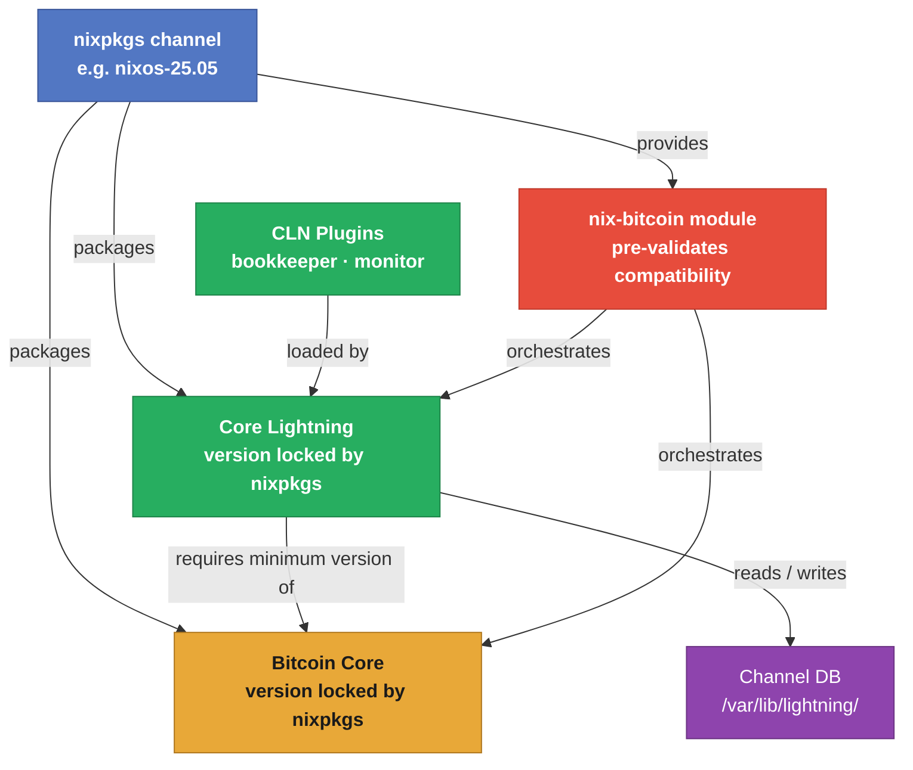
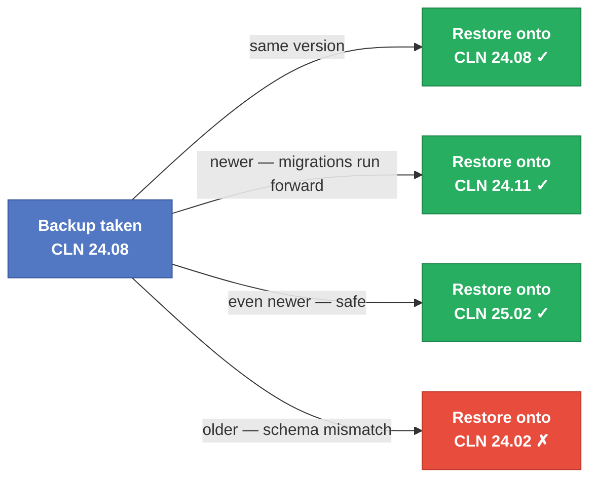

# Workshop 23: Own your versions: Bitcoin stack compatibility and safe upgrades

## Why version compatibility is not optional

Every piece of software has versions. Most software degrades gracefully when versions drift — a slightly old client still talks to a slightly new server. Bitcoin infrastructure does not work that way. Three properties make version management here significantly more consequential than in a typical software stack.

**Protocol-level coupling.** Core Lightning uses Bitcoin Core's JSON-RPC to submit transactions, estimate fees, and watch the chain. When Bitcoin Core deprecates a call that CLN relies on, or when CLN requires a new RPC parameter only available in a newer Core, the mismatch breaks the connection entirely. Each CLN release documents the minimum Bitcoin Core version it requires.

**Forward-only database migrations.** CLN stores channel state in a SQLite database. Every major upgrade runs migration scripts that transform the schema into a new format. These migrations are strictly one-way: a v24.11 node opens a v24.08 database and upgrades it, but a v24.08 node cannot open a v24.11 database. The implication is direct: if you upgrade CLN and then need to restore from a backup (see [Workshop 19](../workshop-19/)), you must restore to the same version or newer — never older.

**Consensus-layer pinning.** Bitcoin Core itself has soft-fork activations tied to specific versions. A node running pre-Taproot Bitcoin Core diverges from the rest of the network on Taproot spends. Running an outdated Bitcoin Core is not merely a feature gap — it is a consensus failure that silently puts your node on a minority chain.

---

## The version chain

Every component you run derives its version from one upstream decision: which nixpkgs channel your `flake.nix` pins.



The key insight: **you do not choose Bitcoin Core or CLN versions directly**. You choose a nixpkgs channel, and that channel decides what you get. This is a feature, not a limitation — the package maintainers have already verified that the combination works. When you move to a newer channel, all versions advance together in a tested bundle.

> **nix-bitcoin adds another layer.** The nix-bitcoin module used in [Workshop 10](../workshop-10/) validates that the Bitcoin Core and CLN versions it orchestrates are mutually compatible. Upgrading nix-bitcoin via nixpkgs carries this guarantee implicitly.

---

## Compatibility matrix

The table below shows what each NixOS stable channel ships. Versions are approximate — verify the exact values for your channel with `nix eval` (see [Going Further](#going-further)).

| nixpkgs channel | Released | Bitcoin Core | Core Lightning | CLN min. Bitcoin Core | Status |
|-----------------|----------|-------------|----------------|-----------------------|--------|
| `nixos-23.11` | Nov 2023 | 25.0 | 23.08 | ≥ 22.0 | EOL |
| `nixos-24.05` | May 2024 | 26.1 | 24.02 | ≥ 23.0 | EOL |
| `nixos-24.11` | Nov 2024 | 27.1 | 24.08.1 | ≥ 24.0 | Security only |
| `nixos-25.05` | May 2025 | 28.0 | 24.11.1 | ≥ 25.0 | Current stable |

> Exact minimum Bitcoin Core versions are documented in CLN's [CHANGELOG](https://github.com/ElementsProject/lightning/blob/master/CHANGELOG.md) for each release. Always verify before upgrading.

### What a version bump actually changes

Not all upgrades are equal. Before advancing your nixpkgs channel, check the CLN release notes for four categories of change:

| Category | Example | Impact |
|----------|---------|--------|
| **DB migration** | New column in the `channels` table | Forward-only; take a backup before upgrading |
| **RPC deprecation** | `listpeers` removed in favour of `listpeerchannels` | Breaks any script or plugin using the old call |
| **Bitcoin Core minimum bump** | CLN now requires Core ≥ 25.0 | Must upgrade Core first or simultaneously |
| **Protocol change** | Splicing, async payments | Usually additive; verify peer compatibility |

---

## The recovery dimension

This is where version discipline connects directly to [Workshop 19](../workshop-19/). When restoring a CLN node from backup, the version you restore onto must be **greater than or equal to** the version that wrote the backup.



**Practical rule:** record the software versions in your node's backup documentation alongside the backup date. A one-line note — `CLN 24.08.1, Bitcoin Core 27.1, backup 2025-01-15` — eliminates all guesswork during disaster recovery.

---

## Going Further

### 1 — Inspect what versions are actually running

Check the live version inside each container directly:

```bash
# Core Lightning version in the lightning container
sudo nixos-container run lightning -- lightningd --version
# → Core Lightning 24.11.1

# Or ask the running daemon via RPC for version and network
sudo nixos-container run lightning -- lightning-cli getinfo | jq '{version: .version, network: .network}'
```

For Bitcoin Core (which runs in the VM in Workshop 10):

```bash
# From the host — ask the bitcoind RPC for its version
sudo nixos-container run lightning -- \
  bitcoin-cli -rpcconnect=<vm-ip> -rpcport=38332 getnetworkinfo | jq '.version'
# Version is encoded as integer: 280000 = v28.0.0
```

### 2 — Query nixpkgs before committing to a change

You can check what any channel provides without modifying your flake:

```bash
# What CLN version does nixos-25.05 ship?
nix eval github:NixOS/nixpkgs/nixos-25.05#clightning.version

# What Bitcoin Core version?
nix eval github:NixOS/nixpkgs/nixos-25.05#bitcoind.version

# Compare with the previous stable channel
nix eval github:NixOS/nixpkgs/nixos-24.11#clightning.version
nix eval github:NixOS/nixpkgs/nixos-24.11#bitcoind.version
```

Check which nixpkgs commit your current flake resolves to:

```bash
cd workshop-10
nix flake metadata
# The nixpkgs input line shows the resolved git revision and last-modified date
```

You can also ask what version your own flake configuration would build, without actually building it:

```bash
nix eval .#nixosConfigurations.lightning.pkgs.clightning.version
```

### 3 — Understand who controls the CLN version in workshop-10

Before changing any version, read the actual inputs block in workshop-10's `flake.nix`:

```nix
inputs = {
  nix-bitcoin.url = "github:fort-nix/nix-bitcoin/master";
  nixpkgs.follows = "nix-bitcoin/nixpkgs";  # nixpkgs is wired to nix-bitcoin's own pin
};
```

The `follows` line is critical. Workshop-10 does **not** independently pin nixpkgs. It delegates that choice to nix-bitcoin. CLN's version is therefore whatever nix-bitcoin's internal nixpkgs provides — not a value you can change by editing a URL in this flake alone.

Check what nix-bitcoin currently resolves to:

```bash
cd workshop-10

# What nixpkgs commit does nix-bitcoin pull in?
nix flake metadata | grep -A 3 "nix-bitcoin"

# What CLN version does that produce?
nix eval .#nixosConfigurations.lightning.pkgs.clightning.version
```

The three sections below show how to take control of that version.

---

### 4 — Upgrading CLN independently of the full channel

The channel-level approach (section 5) bumps Bitcoin Core, CLN, and every other package simultaneously. Sometimes you need only CLN to change — a security patch in CLN 24.11.2 while you are not ready to move to a new channel, or a new CLN feature you need without disrupting anything else. There are three approaches, in order of increasing surgical precision.

---

**Approach A — Pin nix-bitcoin to a specific release**

nix-bitcoin publishes versioned releases, each of which pins a tested Bitcoin Core + CLN combination. This is the safest option because nix-bitcoin's own integration tests cover that exact pairing.

```nix
inputs = {
  # Pin to a specific nix-bitcoin release tag instead of master
  nix-bitcoin.url = "github:fort-nix/nix-bitcoin/master";
  nixpkgs.follows = "nix-bitcoin/nixpkgs";  # still follow nix-bitcoin's nixpkgs
};
```

Check what CLN version a given nix-bitcoin release ships before committing.
nix-bitcoin does not expose CLN as a flake package output — CLN comes from its pinned nixpkgs.
Use `--inputs-from` to borrow nix-bitcoin's own nixpkgs input:

```bash
nix eval --inputs-from github:fort-nix/nix-bitcoin/v0.0.134 nixpkgs#clightning.version
```

List available release tags:

```bash
git ls-remote https://github.com/fort-nix/nix-bitcoin 'refs/tags/v*' | sort -t/ -k3 -V
```

After editing `flake.nix`:

```bash
nix flake lock
nix eval .#nixosConfigurations.lightning.pkgs.clightning.version  # verify
sudo nixos-container update lightning --flake .#lightning
sudo nixos-container run lightning -- lightningd --version
```

---

**Approach B — Take control of nixpkgs (reverse the `follows`)**

Remove the delegation: give the flake its own nixpkgs pin and make nix-bitcoin follow *your* pin instead of the other way around. CLN's version is then determined by whichever nixpkgs channel you choose.

Edit the `inputs` block in `workshop-10/flake.nix`:

```nix
inputs = {
  nix-bitcoin.url = "github:fort-nix/nix-bitcoin/master";

  # Own independent nixpkgs pin — you control the CLN version here
  nixpkgs.url = "github:NixOS/nixpkgs/nixos-25.05";

  # Make nix-bitcoin use YOUR nixpkgs instead of its own
  nix-bitcoin.inputs.nixpkgs.follows = "nixpkgs";
};
```

To pin to an exact commit for maximum reproducibility:

```nix
nixpkgs.url = "github:NixOS/nixpkgs/a1b2c3d4e5f6...";  # full 40-char SHA
```

Find the commit SHA for a specific nixpkgs branch state:

```bash
git ls-remote https://github.com/NixOS/nixpkgs refs/heads/nixos-25.05
```

Then verify and apply:

```bash
nix flake lock
nix eval .#nixosConfigurations.lightning.pkgs.clightning.version
sudo nixos-container update lightning --flake .#lightning
sudo nixos-container run lightning -- lightningd --version
```

> **Caveat:** nix-bitcoin is tested against its own pinned nixpkgs. Pointing it at a very different channel can surface incompatibilities in nix-bitcoin's own modules. Choose a nixpkgs version close to nix-bitcoin's own pin, and test before applying to a node with open channels.

---

**Approach C — Override the CLN package via a nixpkgs overlay**

> **Use Approach B instead for CLN.** nixpkgs's `clightning` derivation manages external dependencies (libwally-core, secp256k1) as separate nixpkgs derivations placed into the source tree via `postUnpack`. A simple `overrideAttrs { version; src }` replaces the source but carries over patches and build infrastructure written for the previous version — these will break or silently misbehave for a different CLN version. The overlay pattern works well for simpler packages (as workshop-10 already demonstrates for the Mutinynet Bitcoin binary), but CLN is not a simple package.
>
> Approach B — finding the nixpkgs commit where CLN was bumped to the target version — gives you the entire self-consistent derivation (source, patches, libwally-core version, build flags) without having to reconstruct any of it by hand.

For reference, the pattern looks like this and works for simpler derivations that have no external-dependency scaffolding:

```nix
# Example only — not recommended for CLN
{
  nixpkgs.overlays = [
    (final: prev: {
      some-simple-package = prev.some-simple-package.overrideAttrs (old: rec {
        version = "x.y.z";
        src = prev.fetchFromGitHub {
          owner = "upstream";
          repo  = "repo";
          rev   = "v${version}";
          hash  = "sha256-AAAAAAAAAAAAAAAAAAAAAAAAAAAAAAAAAAAAAAAAAAA=";
        };
      });
    })
  ];
}
```

For CLN specifically, use Approach B: find the nixpkgs commit that introduced the target CLN version and pin your flake to it.

```bash
# Check if nixpkgs-unstable already ships the version you want
nix eval github:NixOS/nixpkgs/nixpkgs-unstable#clightning.version

# Find the commit that introduced it — search nixpkgs commit history:
# https://github.com/NixOS/nixpkgs/commits/nixpkgs-unstable
# look for a commit titled "clightning: X.Y.Z -> X.Y.Z+1"

# Pin that SHA in flake.nix (Approach B) and verify before applying
nix eval .#nixosConfigurations.lightning.pkgs.clightning.version
nix flake lock
sudo nixos-container update lightning --flake .#lightning
sudo nixos-container run lightning -- lightningd --version
```

---

### 5 — Advancing the full channel (everything at once)

Moving the entire nixpkgs channel forward (e.g., `nixos-24.11` → `nixos-25.05`) upgrades Bitcoin Core, CLN, and all other packages simultaneously. This requires Approach B from section 4 first (taking ownership of nixpkgs), then:

```bash
# Step 1 — read the CLN changelog for the full version gap
#   https://github.com/ElementsProject/lightning/blob/master/CHANGELOG.md
#   Look for: DB migrations, RPC removals, new Bitcoin Core minimum

# Step 2 — back up channel state before touching anything (see Workshop 19)
sudo nixos-container run lightning -- lightning-cli stop
# copy /var/lib/nixos-containers/lightning/var/lib/lightning/ to a safe location
sudo nixos-container run lightning -- lightning-cli start  # bring it back up

# Step 3 — edit flake.nix: bump the nixpkgs URL to the new channel

# Step 4 — regenerate the lock file
nix flake lock

# Step 5 — confirm versions before applying
nix eval .#nixosConfigurations.lightning.pkgs.clightning.version
nix eval .#nixosConfigurations.lightning.pkgs.bitcoind.version

# Step 6 — apply
sudo nixos-container update lightning --flake .#lightning

# Step 7 — confirm CLN started cleanly (DB migrations run on first start after upgrade)
sudo nixos-container run lightning -- journalctl -u cln -n 40
```

### 6 — When to hold vs. advance

| Scenario | Action |
|----------|--------|
| Security patch in CLN, nothing else changes | Approach A (pin nix-bitcoin release) or B (nixpkgs commit with that CLN version) — CLN's derivation is too complex for the overlay approach |
| New CLN minor version, staying on same nixpkgs channel | Approach B (reverse follows, pin nixpkgs to a commit that has the target CLN version) |
| Full channel upgrade (24.11 → 25.05) | Section 5 — back up first, read changelogs for both CLN and Bitcoin Core |
| Reproducing a historical state exactly | Approach B with an exact 40-character nixpkgs commit SHA |
| Production node with open channels | Test the upgrade path in a regtest environment ([Workshop 9](../workshop-9/)) before applying to a live node |

---

## References

- [CLN CHANGELOG — minimum Bitcoin Core version per release](https://github.com/ElementsProject/lightning/blob/master/CHANGELOG.md)
- [nixpkgs release history](https://github.com/NixOS/nixpkgs/releases)
- [Nixpkgs package search — find versions by channel](https://search.nixos.org/packages)
- [NixOS stable channels](https://nixos.org/channels/)
- [Workshop 10: Own your signet — Bitcoin VM + Lightning container on Mutinynet](../workshop-10/)
- [Workshop 19: Own your recovery — Destroy and restore your Bitcoin and Lightning node](../workshop-19/)
