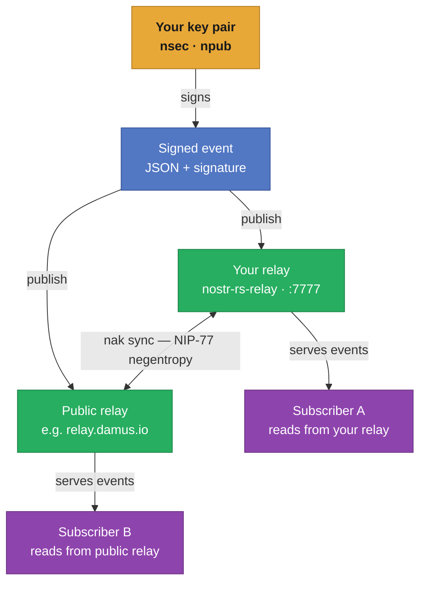

# Workshop 30: Own your Nostr relay in 5 minutes

## What is Nostr?

**Nostr** stands for *Notes and Other Stuff Transmitted by Relays*. It is an open protocol for a censorship-resistant, decentralised global network — not a platform, not a company, and not a blockchain. Two ideas hold the whole thing together:

**Cryptographic identity.** Every user is identified by a public/private key pair (Ed25519). There is no registration, no email address, no username approval. You generate a key pair and that *is* your identity. Your private key signs every message you send; anyone with your public key can verify it is genuinely yours.

**Relays are just dumb pipes.** A relay is a WebSocket server that accepts signed events from clients and serves them back on request. Relays have no special authority — they cannot modify or forge your messages because every message is signed. If a relay censors you or goes offline, you publish to another. Your content is not owned by any relay; it belongs to your key pair.

This combination makes Nostr fundamentally different from Twitter, Mastodon, or Bluesky: there is no single point of control, no corporate moderation, and no account that can be deleted by a platform. The protocol is deliberately minimal — just JSON events, WebSockets, and cryptographic signatures — which makes it easy to implement, audit, and extend.

Nostr now powers social timelines, long-form articles, encrypted DMs, Lightning Zaps (micropayments attached to posts), file hosting, and even Git repositories — all through the same key pair and the same relay infrastructure.

---

## Architecture



---

## Prerequisites

- **[Workshop 6](../workshop-6/)** — containers running, host bridge and NAT in place.

This workshop uses the same host network infrastructure as workshop-6 (bridge `br-containers`, dnsmasq DHCP, NAT). The `.nix` files in this directory are the workshop-6 base files with the Nostr relay added in `nostr.nix`. Nothing new is introduced on the host side.

---

## File Structure

| File | Purpose |
|------|---------|
| `host-setup.nix` | Unchanged copy from workshop-6 — bridge, NAT, DHCP |
| `configuration.nix` | Unchanged base container config from workshop-6 |
| `nostr.nix` | Nostr-specific additions: relay service + `nak` CLI tool |
| `flake.nix` | Defines the `nostr` container composing the above modules |

---

## Part 1: Launch the Relay Container

Create and start the container (same pattern as workshop-6):

```bash
cd workshop-30
sudo nixos-container create nostr --flake .#nostr
sudo nixos-container start nostr
```

Confirm the relay is up:

```bash
sudo nixos-container run nostr -- systemctl status nostr-relay
```

You should see `active (running)`. The relay is now listening on port 7777 inside the container.

Find the container's IP — you will need it for all subsequent commands:

```bash
NOSTR_IP=$(sudo nixos-container run nostr -- ip -4 addr show eth0 | awk '/inet /{print $2}' | cut -d/ -f1)
echo "Relay: ws://$NOSTR_IP:7777"
```

Verify the WebSocket port is reachable from the host:

```bash
curl --include --no-buffer \
  --header "Connection: Upgrade" \
  --header "Upgrade: websocket" \
  --header "Sec-WebSocket-Key: dGhlIHNhbXBsZSBub25jZQ==" \
  --header "Sec-WebSocket-Version: 13" \
  http://$NOSTR_IP:7777
```

A `101 Switching Protocols` response confirms the relay is accepting WebSocket connections.

---

## Part 2: Generate a Key Pair

Every action in Nostr requires a key pair. Generate one with `nak` — run this from inside the container or from the host if you have `nak` installed:

```bash
sudo nixos-container run nostr -- bash -c '
  NSEC=$(nak key generate)
  NPUB=$(echo $NSEC | nak key public)
  echo "Private key (nsec): $NSEC"
  echo "Public  key (npub): $NPUB"
'
```

> Keep the private key (`nsec`) safe. Anyone with it can publish events as you. The public key (`npub`) is your identity — share it freely.

Save the private key for the session:

```bash
NSEC=$(sudo nixos-container run nostr -- nak key generate)
echo "Your nsec: $NSEC"
```

---

## Part 3: Publish Your First Note

Post a signed text note (Nostr event kind 1) to your relay:

```bash
sudo nixos-container run nostr -- \
  nak event --sec $NSEC -c "Hello from workshop-30. My relay is alive." \
    ws://localhost:7777
```

Read it back — subscribe to all kind-1 events on your relay:

```bash
sudo nixos-container run nostr -- \
  nak req -k 1 --limit 5 ws://localhost:7777
```

You should see your event returned as a JSON object with your public key, timestamp, content, and cryptographic signature.

---

## Part 4: Broadcast to Multiple Relays Simultaneously

This is where Nostr's architecture becomes tangible. A single `nak event` call can publish the **same signed event** to any number of relays at once. The event has one ID and one signature — it is identical on every relay that stores it.

```bash
sudo nixos-container run nostr -- \
  nak event --sec $NSEC \
    -c "This note lives on my relay AND a public relay. Neither can alter it." \
    ws://localhost:7777 \
    wss://relay.damus.io
```

Confirm the note is on your relay:

```bash
sudo nixos-container run nostr -- \
  nak req -k 1 --limit 3 ws://localhost:7777 | jq .content
```

Confirm the exact same event arrived on the public relay:

```bash
sudo nixos-container run nostr -- \
  nak req -k 1 --limit 3 wss://relay.damus.io | jq .content
```

The same event ID, same signature, on two independent servers — neither of which can modify it.

---

## Part 5: Relay-to-Relay Sync (Federation)

`nak sync` implements **NIP-77 Negentropy** — an efficient set-reconciliation protocol that compares the event sets of two relays and transfers only what is missing on each side. This is how Nostr relays federate: not through a centralised directory, but by two relays comparing what they have and exchanging the difference.

Pull events from a public relay into your relay:

```bash
sudo nixos-container run nostr -- \
  nak sync wss://relay.damus.io ws://localhost:7777
```

The output shows how many events were transferred in each direction. Run it again immediately — the second sync transfers nothing because both sides are now in agreement.

Verify: your relay now holds events it did not originate:

```bash
sudo nixos-container run nostr -- \
  nak req -k 1 --limit 10 ws://localhost:7777 | jq '[.pubkey, .content]'
```

You will see events signed by keys other than yours — pulled from the public relay and now stored locally.

---

## Troubleshooting

**Relay not starting:**
```bash
sudo nixos-container run nostr -- journalctl -u nostr-relay -n 40
```

**WebSocket connection refused from host:**

Confirm the container is up and the port is open:
```bash
sudo nixos-container run nostr -- ss -tlnp | grep 7777
```

**`nak sync` reports "relay does not support negentropy":**

Fall back to the manual pipe approach, which works with any relay:
```bash
sudo nixos-container run nostr -- bash -c '
  nak req -k 1 --limit 500 wss://relay.damus.io | \
    nak event ws://localhost:7777
'
```

**Key not persisting between commands:**

Generate and store the key in a file inside the container:
```bash
sudo nixos-container run nostr -- bash -c '
  nak key generate > /root/nostr-nsec.txt
  cat /root/nostr-nsec.txt
'
# Then load it:
NSEC=$(sudo nixos-container run nostr -- cat /root/nostr-nsec.txt)
```

---

## Going Further

The relay and key pair you have running are a complete, production-capable Nostr node. A few directions to explore next:

| Idea | What it involves |
|------|-----------------|
| **Connect a web client** | Point [Coracle](https://coracle.social) or [Snort](https://snort.social) to `ws://<host-ip>:7777` and use your relay from a browser |
| **Private relay** | Add `[authorization] pubkey_whitelist = ["<your-npub>"]` to `relayConfig` in `nostr.nix` — only your key can publish |
| **Automatic federation** | Add a `systemd.timers` entry in `nostr.nix` that runs `nak sync` against a chosen public relay every hour |
| **Two relay containers** | Create a second relay container (`nostr2`) and run `nak sync ws://nostr:7777 ws://nostr2:7777` to federate them — fully local, no public internet needed |
| **NIP-05 identity** | Serve a `/.well-known/nostr.json` file via nginx so your key is verifiable as `you@yourdomain.com` |
| **Encrypted DMs (NIP-17)** | `nak event -k 14 --sec $NSEC -p <recipient-npub> -c "secret message" ws://localhost:7777` |
| **Lightning Zaps (NIP-57)** | Integrate a Lightning node (see workshop-10) to attach micropayments to events |
| **Nostr over Tor** | Configure the relay container with a hidden service so the WebSocket address is an `.onion` URL |

---

## References

- [Workshop 6: Manage NixOS Containers via CLI](../workshop-6/)
- [nostr-rs-relay source](https://github.com/scsibug/nostr-rs-relay)
- [nak — Nostr Army Knife](https://github.com/fiatjaf/nak)
- [Nostr protocol NIPs](https://github.com/nostr-protocol/nostr)
- [NIP-77: Negentropy syncing](https://github.com/nostr-protocol/nips/blob/master/77.md)
- [nostr.how — beginner guide](https://nostr.how)
